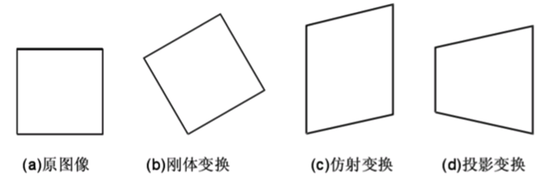

# t-SNE算法

t-SNE(t-distributed stochastic neighbor embedding)是用于**降维**的一种机器学习算法，是由 Laurens van der Maaten 和 Geoffrey Hinton在08年提出来。此外，t-SNE 是一种非线性降维算法，非常适用于高维数据降维到2维或者3维，进行可视化。相比于常用的PCA降维，两者的区别是：

- PCA降维：线性降维方法。将高维数据降至低维（例如从100维降至20-30维），便于后续处理
- t-SNE降维：非线性降维方法。通常将数据降低至2-3维，只要是为了数据可视化

t-SNE是由SNE(Stochastic Neighbor Embedding, SNE; Hinton and Roweis, 2002)发展而来。我们先介绍SNE的基本原理，之后再扩展到t-SNE。最后再看一下t-SNE的实现以及一些优化。

## 1. SNE算法

### 仿射变换

仿射变换(Affine Transformation) 是一种二维坐标到二维坐标之间的线性变换，保持二维图形的“平直性”（译注：straightness，即变换后直线还是直线不会打弯，圆弧还是圆弧）和“平行性”（译注：parallelness，其实是指保二维图形间的相对位置关系不变，平行线还是平行线，相交直线的交角不变）  。

### 1.1 基本思想

SNE是通过仿射变换将数据点映射到概率分布上，主要包括两个步骤：

- SNE构建一个高维对象之间的概率分布，使得相似的对象有更高的概率被选择，而不相似的对象有较低的概率被选择。
- SNE在低维空间里在构建这些点的概率分布，使得这两个概率分布之间尽可能的相似。

t-SNE模型是非监督的降维聚类，跟kmeans等不同是，算法不能通过训练确定参数之后再用于其它数据（比如kmeans可以通过训练得到k个点，再用于其它数据集，而t-SNE只能单独的对数据做操作，也就是说他只有fit_transform，而没有fit操作）

### 1.2 原理推导

## 2. t-SNE算法

## 参考文献

1. https://www.zhihu.com/question/52022955/answer/387753267
2. http://www.datakit.cn/blog/2017/02/05/t_sne_full.html#11%E5%9F%BA%E6%9C%AC%E5%8E%9F%E7%90%86