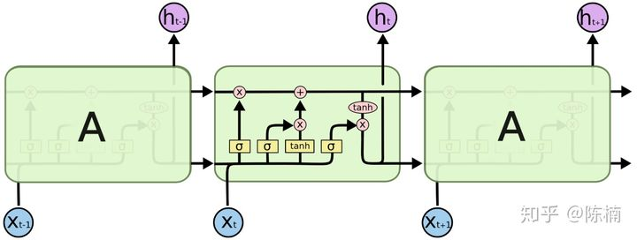

# LSTM结构

长短期记忆（Long short-term memory, LSTM）是一种特殊的RNN，主要是为了解决长序列训练过程中的梯度消失和梯度爆炸问题。简单来说，就是相比普通的RNN，LSTM能够在更长的序列中有更好的表现。

## 1. LSTM的结构

LSTM相比普通的RNN添加了细胞状态$C$，（图中上面的横线），LSTM引入了门控机制，具体结构包括遗忘门、输入门和输出门。

可以参看这篇网文：https://zhuanlan.zhihu.com/p/104475016

## 2. LSTM的反向传播

参考文献：https://zhuanlan.zhihu.com/p/80434556

# GRU结构

一个更有意思的 LSTM 变种称为 Gated Recurrent Unit（GRU），由 Cho 等人提出。LSTM通过三个门函数输入门、遗忘门和输出门分别控制输入值、记忆值和输出值。而GRU中只有两个门：更新门和重置门

## 1. GRU结构

更新门用于控制前一时刻的状态信息被带入到当前状态中的程度，更新门的值越大说明前一时刻的状态信息带入越多；重置门控制前一时刻状态有多少信息被写入到当前的候选集上，重置门越小，前一状态的信息被写入的越少。

## 2.GRU反向传播

参考文献：https://zhuanlan.zhihu.com/p/83496936

