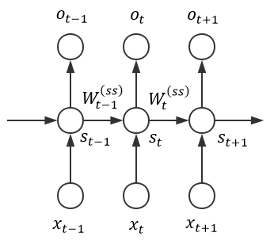
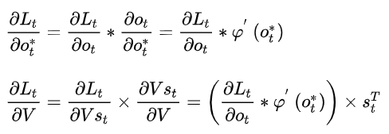
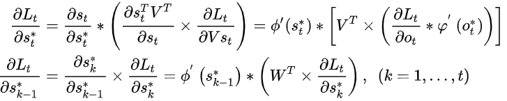
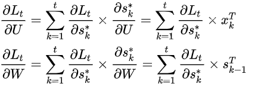

# RNN结构

## 1.RNN出现的原因

传统神经网络只能单独的取处理一个个的输入，前一个输入和后一个输入是完全没有关系的。但是，某些任务需要能够更好的处理序列的信息，即前面的输入和后面的输入是有关系的。

在自然语言处理、时序信号处理中十分常用

## 2. RNN结构

RNN的结构很简单，包括输入$X_t$、RNN层$A$、输出$h_t$,$t$表示时间序列。RNN层以以当前时刻的输入$X$和上一时刻RNN层的输出为输入，如果将上述网络结构展开，则结构更加明显：

这种像是链状的网络结构表明RNN和序列以及列表有着天然的联系，他们是处理这些序列数据的天然的神经网络。而且很明显我们可以看出，输入输出的序列是具有相同的时间长度的，其中的每一个权值都是共享的（都是相同的A，只是A的输入有所区别）

## 3. RNN计算过程

### 3.1 前向传播

RNN的前向传播计算过程如下：
$$
\begin{align}
s^*_t&=Ws_{t-1}+Ux_t\\
s_t&=\phi(s^*_t)\\
o^*_t&=Vs_t\\
o_t&=\varphi(Vs_t)
\end{align}
$$

### 3.2 时序反向传播BPTT

依照上图，记$L_t$为t时刻的类标$y_t$和输出$o_t$的损失函数，$*$表示元素相乘，$\times$表示矩阵相乘，则：

- 对权值矩阵V的梯度计算：

- 对循环状态的局部梯度计算：

注意到由于 RNN 需要沿时间通道进行反向传播，这意味着局部梯度受$W$和各个激活函数的梯度的影响是指数级的。若只考虑激活函数，则当时间状态的激活函数是sigmoid函数时，容易参数梯度消失的问题，当使用relu函数时，则容易产生梯度爆炸问题。再考虑到$W$的累计，梯度爆炸问题可能会很常见。

- 对权值矩阵U和W的梯度计算：

