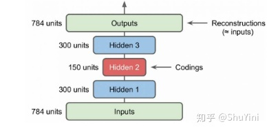

# 变分自编码器

## 自编码器

自编码器（Autoencoder，AE），是一种利用反向传播算法使得输出值等于输入值的神经网络，它先将输入压缩成潜在空间表征，然后通过这种表征来重构输出。如果自编码器的唯一目的是让输出值等于输入值，那这个算法将毫无用处。事实上，我们希望通过训练输出值等于输入值的自编码器，**让潜在表征h将具有价值属性**。

自编码器由两部分组成：

**编码器**：这部分能将输入压缩成潜在空间表征，可以用编码函数h=f(x)表示。

**解码器**：这部分能重构来自潜在空间表征的输入，可以用解码函数r=g(h)表示。

### 自编码器的特点

1、自动编码器是数据相关的（data-specific 或 data-dependent），这意味着自动编码器只能压缩那些与训练数据类似的数据。比如，使用人脸训练出来的自动编码器在压缩别的图片，比如树木时性能很差，因为它学习到的特征是与人脸相关的。

2、自动编码器是有损的，意思是解压缩的输出与原来的输入相比是退化的，MP3，JPEG等压缩算法也是如此。这与无损压缩算法不同。

3、自动编码器是从数据样本中自动学习的，这意味着很容易对指定类的输入训练出一种特定的编码器，而不需要完成任何新工作。

### 常见的自编码器

**堆栈自动编码器** 前面讲的自编码器只是简答的含有一层，其实可以采用更深层的架构，这就是堆栈自动编码器或者深度自动编码器，本质上就是增加中间特征层数。这里我们以MNIST数据为例来说明自动编码器，建立两个隐含层的自动编码器，如下图所示：

    对于MNIST来说，其输入是$28*28=784$维度的特征，这里使用了两个隐含层其维度分别为300和150，可以看到是不断降低特征的维度了。得到的最终编码为150维度的特征，使用这个特征进行反向重构得到重建的特征，我们希望重建特征和原始特征尽量相同。

**欠完备自编码器**从自编码器获得有用特征的一种方法是限制 h的维度比 x 小，这种编码维度小于输入维度的自编码器称为欠完备（undercomplete）自编码器。学习欠完备的表示将强制自编码器捕捉训练数据中最显著的特征。

**正则自编码器**使用的损失函数可以鼓励模型学习其他特性（除了将输入复制到输出），而不必限制使用浅层的编码器和解码器以及小的编码维数来限制模型的容量。这些特性包括稀疏表示、表示的小导数、以及对噪声或输入缺失的鲁棒性。即使模型容量大到足以学习一个无意义的恒等函数，非线性且过完备的正则自编码器仍然能够从数据中学到一些关于数据分布的有用信息。**常用的正则自编码器包括：稀疏自编码器以及降噪自编码器**

- 稀疏自编码器：一般用来学习特征，以便用于像分类这样的任务。稀疏正则化的自编码器必须反映训练数据集的独特统计特征，而不是简单地充当恒等函数。以这种方式训练，执行附带稀疏惩罚的复现任务可以得到能学习有用特征的模型。还有一种用来约束自动编码器重构的方法，是对其损失函数施加约束。比如，可对损失函数添加一个正则化约束，这样能使自编码器学习到数据的稀疏表征。
- 降噪自编码器：通过改变损失函数的重构误差项来学习一些有用信息。向训练数据加入噪声，并使自编码器学会去除这种噪声来获得没有被噪声污染过的真实输入。因此，这就迫使编码器学习提取最重要的特征并学习输入数据中更加鲁棒的表征，这也是它的泛化能力比一般编码器强的原因。

**去噪自编码器**（denoisingautoencoder, DAE）是一类接受损坏数据作为输入，并训练来预测原始未被损坏数据作为输出的自编码器。

## 变分自编码器

变分自编码器（Variational Auto-Encoders，VAE）作为深度生成模型的一种形式，是由 Kingma 等人于 2014 年提出的基于变分贝叶斯（Variational Bayes，VB）推断的生成式网络结构。与传统的自编码器通过数值的方式描述潜在空间不同，它以概率的方式描述对潜在空间的观察。

参考：[变分自编码器VAE：原来是这么一回事 | 附开源代码 - 知乎 (zhihu.com)](https://zhuanlan.zhihu.com/p/34998569)

[一文理解变分自编码器（VAE） - 知乎 (zhihu.com)](https://zhuanlan.zhihu.com/p/64485020)

