# Deep Interest Network

## 研究任务与现存问题

这篇来自阿里妈妈团队的论文主要研究的是推荐系统里CTR（click-through rate）预测任务。CTR预测任务是指在给定用户的一系列历史浏览数据后，判断用户是否会点击某个潜在的item。

现有的CTR预测以深度学习模型为主，但这些方法普遍一个问题：

- 无论待推荐的item如何变化，用户的所有历史浏览数据被编码成一个固定长度的向量，即无论candidate item怎么变化，用户的历史浏览数据编码过程是不变的。现有模型在处理这类情况时，将用户的历史数据分别嵌入到向量空间并拼接，最后使用average pooling将特征平均并变换到固定长度，便于后续全连接层推理。但是考虑如下的情景：

  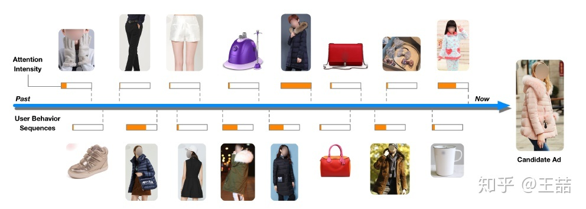

  当推荐的item是一件女士羽绒大衣时，用户历史浏览数据包含的棉大衣等是主要依据，类似杯子、手袋等都是次要因素。此时使用average pooling和固定大小的特征向量并不能很好反映用户。

- 由于训练数据的稀疏性，训练工业级的推荐系统比较困难。在大规模稀疏场景下，L2正则的计算开销会很大。

## 创新点

- 作者提出了一个Deep Interest Network用于CTR预测任务。DIN网络中的local activation unit将根据带推荐的item动态调整用户的不同历史行为数据的权重，生成更有效的用户行为向量。

- 作者设计了2种模型训练方法：mini-batch aware regularization以及自适应激活函数Dice

- 提供了一个公共数据集，与现有数据集的对比如下：

  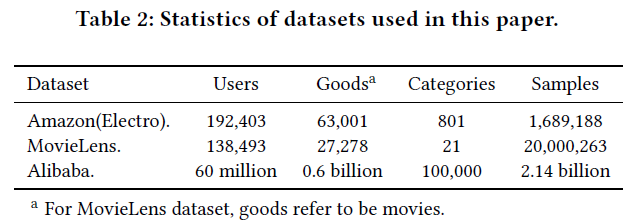

## 模型结构

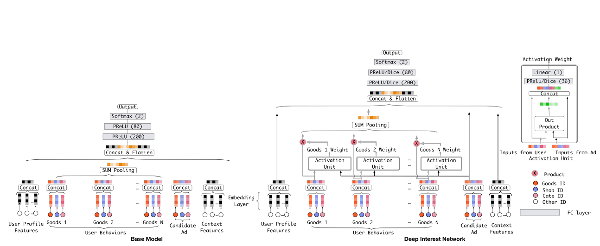

上图左边展示的便是DIN的base model。由嵌入层与全连接网络组成。对于输入的不同组的信息，如用户个人信息、行为数据、待推荐的item信息等，embedding层将其嵌入，变成特征向量，再将不同组的向量拼接起来得到固定长度的特征，送入全连接网络处理，输出预测的CTR概率。

### local activation unit

针对用户行为数据的编码问题，作者提出了一个local activation unit，可以说是利用了attention思想，根据当前的推荐对用户行为数据进行加权处理。其中local activation unit的输入包括两个部分，一个是原始的用户行为embedding向量、广告embedding向量；另外一个是两者Embedding向量经过外积计算后得到的向量，文章指出这种方式有利于relevance modeling。 除此之外文章用到的Attention机制不是原始NLP任务中采用的Attention，文章中放宽了对于权重加和等于一的限制，这样更有利于体现不同用户行为特征之间的差异化程度。

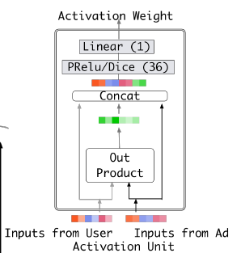

### mini-batch aware regularization

模型的损失函数采用交叉熵实现。具体为：

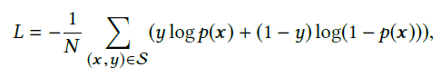

mini-batch aware regularization主要解决的就是在大规模稀疏场景下，采用SGD对引入L2正则的loss进行更新时计算开销过大的问题。该方法只对每一个mini-batch中参数不为0的进行梯度更新，L2正则项的计算如下所示：

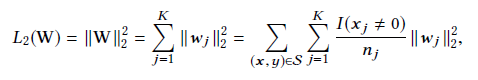

将L2正则项的值累加进loss中，统一进行梯度下降处理。

### 自适应激活函数Dice

作者认为采用PRelu激活函数时，他的rectified point固定为0，这在每一层的输入分布发生变化时是不适用的，所以文章对该激活函数机型了改进，平滑了rectified point附近曲线的同时，激活函数会根据每层输入数据的分布来自适应调整rectified point的位置。

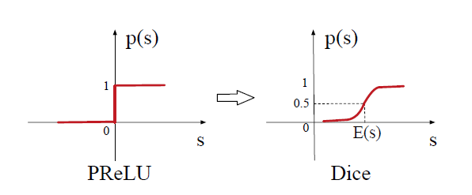

PRelu的计算过程如下：

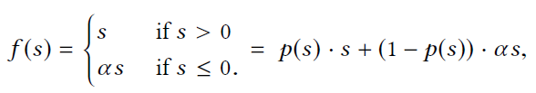

作者修改后的Dice激活函数的计算过程如下：

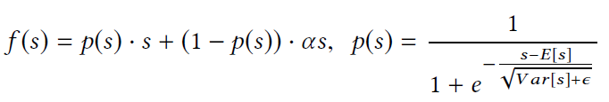

实现时就是在PRelu前添加一个batch normalization，将数据的均值方差归一化。

## 实验对比

- 作者选择用户加权AUC评价模型性能，该指标能更加贴近线上场景。AUC本身是CTR预测任务中常用的评价指标，能够很好得度量推荐顺序。DIN论文里，利用用户的曝光数对uAUC进行加权，可以很好地衡量线上性能：

  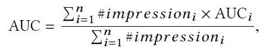

  同时还是用RelaImpr度量各个模型相对于base model性能提升得百分比：

  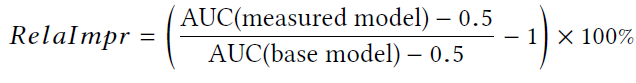

  

  部分数据集上的实验性能如图所示：

  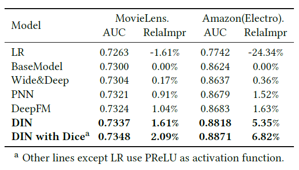

  

  关于mini-batch aware regularization的验证实验：

  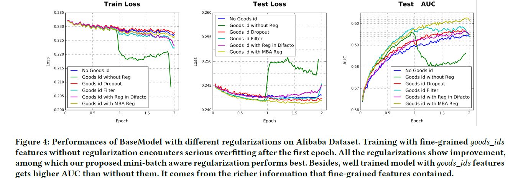

