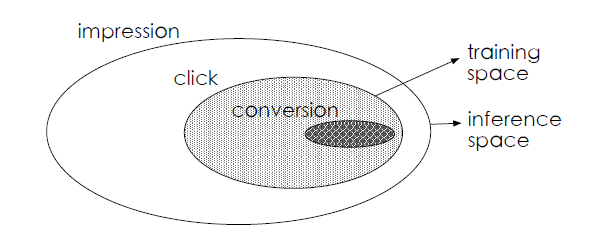
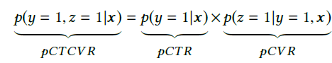
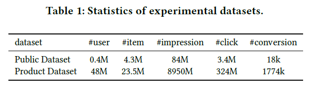
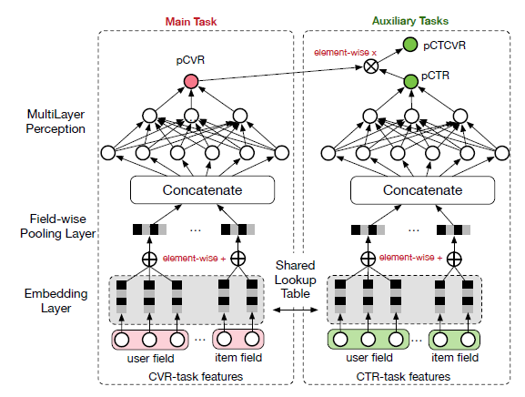
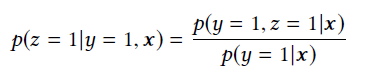
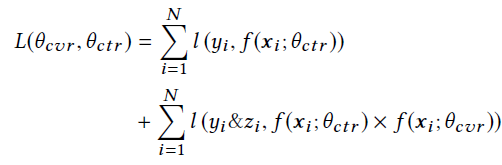
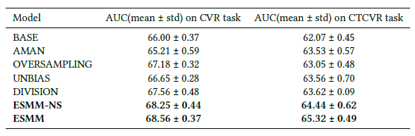
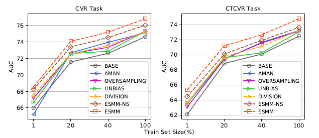

# Entire Space Multi-Task Model

## 研究任务与现存问题

这篇来自阿里妈妈团队的论文主要研究的是推荐系统里CVR（post-click conversion rate）预测任务。在实际场景里CVR预测被用于广告定价等各各方面。

现有的CVR预测以深度学习模型为主，但这些方法普遍存在两个问题：

- Sample Selection Bias（SSB）问题。现有CVR预测模型以点击数据为训练集，训练预测模型；在测试时，对整个样本空间（包括点击与未点击）进行预测。由此可见，训练数据集的样本空间是测试数据集样本空间的子集。此问题会影响现有模型的泛化性能。

  

- Data Sparsity （DS）问题。在实际中，能用于训练CVR模型的数据远少于可用于训练CTR模型的数据，此问题是的CVR模型的训练变得困难。

## 创新点

- 作者从“impression--->click--->conversion”这样的序列入手对CVR预测问题建模。在这个序列中，“impression--->click”是CTR预测任务，“click--->conversion”是CVR预测任务。CVR预测假设的是一个item被点击后的转化率，而不是一个item被点击，然后被转化（CTCVR）的概率。作者在论文中将CTR、CVR、CTCVR之间的关联表述成如下关系：

  

  

  其中CTR、CTCVR的训练可以使用完整的样本空间，避免了SSB问题和DS问题。

- 作者设计了一个参数共享的多任务学习框架实现CVR预测任务

- 提供了一个公共数据集，与现有数据集的对比如下：

  

## 模型结构

如上图所示，ESMM包括左右2个子网络，且这两个子网络的嵌入层是共享的，因此两个子网络的唯一区别在于多层感知器部分。子网络的具体实现可以参考现有研究，ESMM主要贡献在于这个多任务学习的框架。

左侧子网络输入的是预测的CVR值，右侧子网络先输出预测的CTR值，再乘以预测的CVR，得到CTCVR值。这里存在一个隐含的问题，即为什么不直接预测CTR，CTCVR，然后通过除法得到CVR？如下所示

作者认为这样的除法操作是不合适的。首先CTR通常很小，作为分母可能会导致数值计算不稳定；另外这样的除法操作并不能保证CVR的取值范围在[0,1]。

模型的损失函数采用交叉熵实现。分别对CTR、CTCVR计算损失：

这里没有对CVR直接施加监督信号，这样可以有效避免DS问题。

## 实验对比

- 作者选择AUC评价模型性能

- 作者在公共数据集上对比了下列模型的性能

  - BASE：直接实验点击数据训练CVR预测模型
  - AMAN：从unclicked样本中随机抽样作为负例加入点击集合
  - OVERSAMPLING：对点击集中的正例（转化样本）过采样
  - UNBIAS：使用rejection sampling
  - DIVISION：分别训练CTR和CVCTR，相除得到pCVR
  - ESMM-NS：ESMM结构中CVR与CTR部分不share embedding

  

  

作者通过采样的方式表明Data Sparsity问题对模型性能的影响:

