# Transformer

Transformer结构源自Google的论文《Attention is all you need》，是用于解决翻译任务的模型，现在被广泛引用于NLP、CV领域

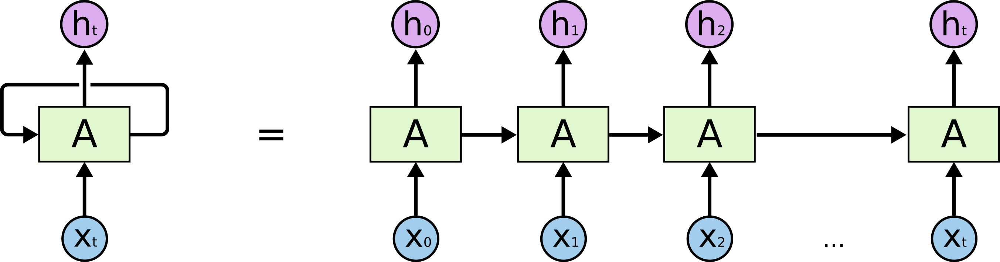

RNN有两个很明显的问题

- 效率问题：需要逐个词进行处理，后一个词要等到前一个词的隐状态输出以后才能开始处理
- 如果传递距离过长还会有梯度消失、梯度爆炸和遗忘问题

为了缓解传递间的梯度和遗忘问题，设计了各种各样的RNN cell，最著名的两个就是LSTM和GRU了

## Transformer模型结构

Transformer解决了RNN效率问题和传递中的缺陷等，在很多问题上都超过了RNN的表现。Transfromer的基本结构如下图所示，它是一个N进N出的结构，也就是说每个Transformer单元相当于一层的RNN层，接收一整个句子所有词作为输入，然后为句子中的每个词都做出一个输出。但是与RNN不同的是，Transformer能够同时处理句子中的所有词，并且任意两个词之间的操作距离都是1，这么一来就很好地解决了上面提到的RNN的效率问题和距离问题。

Transformer模型的整体结构

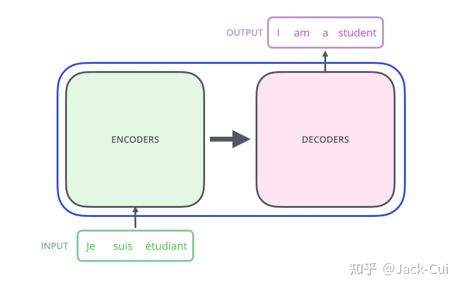

Transformer的内部，在本质上是一个Encoder-Decoder的结构，即编码器-解码器，其中

- **编码器**负责把自然语言序列映射成为隐藏层，即含有自然语言序列的数学表达。

- **解码器**把隐藏层再映射为自然语言序列，从而使我们可以解决各种问题，如情感分析、机器翻译、摘要生成、语义关系抽取等

具体而言，Transformer模型使用6层encoder模块构成encoder，6层decoder模块构成decoder：

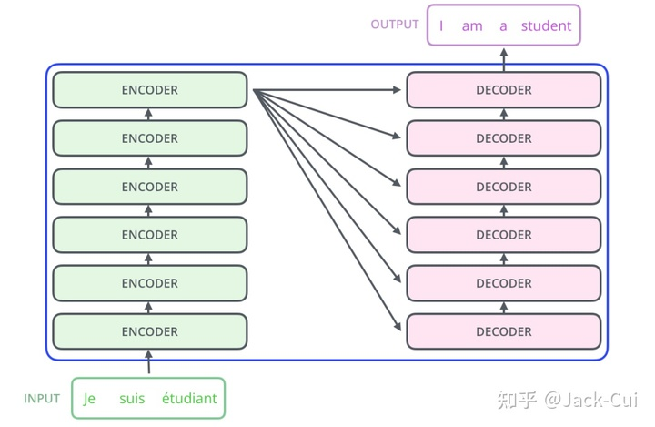

以其中一组encoder模块-decoder模块为例，模块的内部结构为：

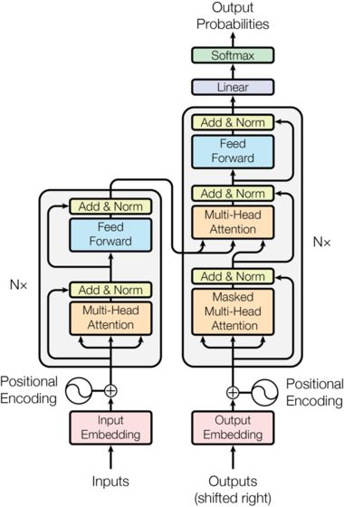

### Input Embedding

输入维度：$[batch\;size, sequence\;length]$

输出维度：$[batch\;size, sequence\;length, embedding\;dimension]$

Transformer的输出是一句句子(所有句子的最长长度为sequence length，其他句子长度不足的补0)，为了后续处理的需要先要将句子中的单词转为为词向量（可称为嵌入 embedding 过程），嵌入过程可以使用Word2Vec等方法实现，每个词嵌入后变为维度为embedding dimension的向量

### Positional Encoding

positional encoding的维度：$[batch\;size, sequence\;length, embedding\;dimension]$

依据常识可知，句子中每个字的顺序是非常重要的，相同的字颠倒顺序所表达的含有就会出现偏差，而transformer的后续结构并没有能捕捉序列顺序的能力（RNN结构是可以的，但transformer没有采用），所以需要显式得将顺序信息组合（确切得说是直接相加）到句子中，这一过程也称为位置嵌入。

**可行方式1：**使用1,2,3..n这样的编码，问题很明显，没有上界。过大的位置embeding，跟词embeding相加，很容易导致词向量本身含义的丢失。所以，我们期望位置向量值不要太大，最好在限定在一个区间内

**可行方式2：**使用1,2,3..n这样的编码，并且除以n,将所有编码归一化至$(0,1]$，但是问题来了。在长文本和短文本的的情况下，同样是差两个字，数值差却不同。所以，我们期望的方法应该不仅能保证值域固定，且不同长度文本，相差相同字数，差相同值。

**可行方式3**：使用周期函数$sin(pos/x)$这样的编码，这是符合期望的，唯一的问题是x的选取。x取值大，则波长大，导致相邻位置的差值变小。x取值过小，则对于长文本来说，很容易就走了几个波峰，导致不同距离，但差值相同。

**Transformer的方式**：transformer为了解决这个问题，人工增加了多样性。将维度不同波长，且sin,cos轮着来：

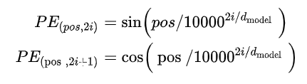

其中pos表示当前字在句子中的位置，取值范围在$[0,sequence\;length)，$i表示当前字的嵌入维度中的位置，取值范围在$[0,embedding\;dimension]$。$d_{model}$是总的嵌入维度，即$embedding\;dimension$

下图展示了采用此类方法的周期变化情况，按列从左至右，最左侧的周期很短，而从5列开始，周期就非常长，足以保证句子内每个位置的编码是不同的。

最终encoder的输出就是input embedding与positional encoding的和

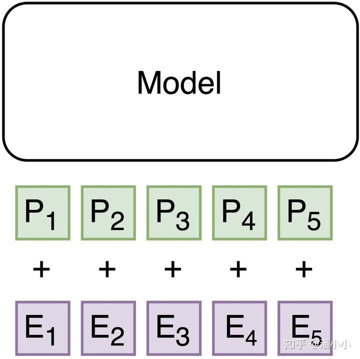

### Encoder模块

#### Multi-Head Attention

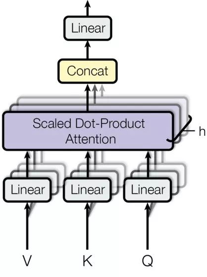

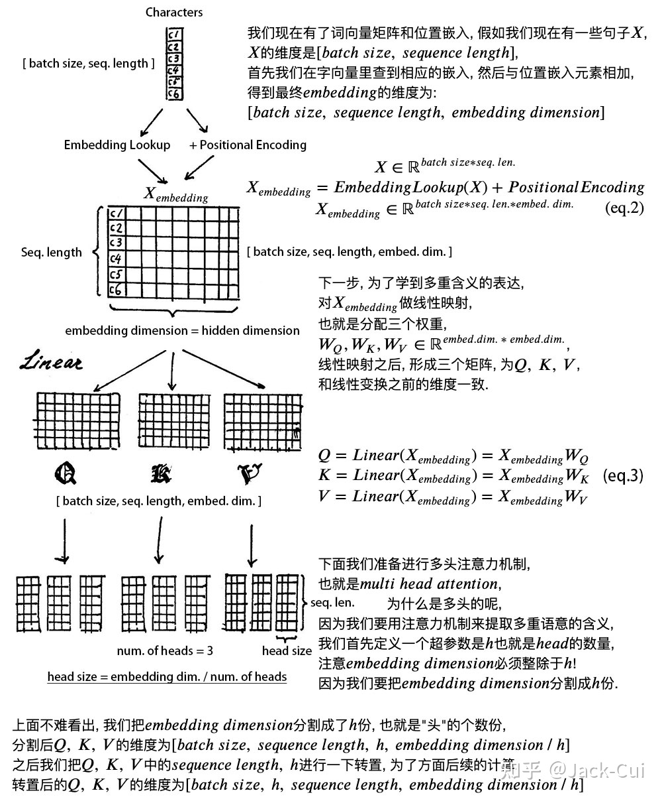

Q：query

K：key

V： value

$d_k$=embedding dimension/h

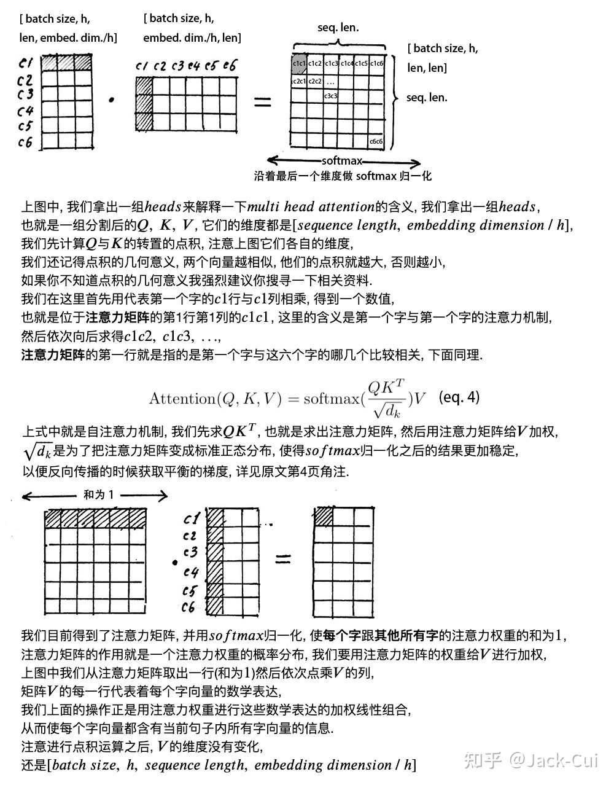

最后将h个head的结果concat在一起，得到维度为$[batch\;size,sequence\;length,embedding\;dimension]$的结果，在对其进行一次线性变化得到Multi-Head Attention的结果

#### Add&Norm

Add&Norm作为残差和归一化层，目的是防止梯度消失，加速收敛。残差实现就是将attention前的输入与attention的结果诸位相加得到，norm的实现是layer norm，目的在于将特征分布变为标准正态分布，加速网络收敛

#### Feed Forward

该层就是一个全连接网络，并包含2个全连接层，使用relu作为激活函数。

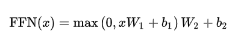

### Decoder模块

Decoder模块与Encoder模块十分相似，不同之处在于添加了Masked Multi-Head Attention。

#### Output(shifted right)

在翻译任务中decoder部分的输入是上一时刻的解码结果，初始时的输入为起始符$<s>$。

以下展示了decoder部分的运行过程

<iframe      height=450      width=800      src="https://vdn1.vzuu.com/SD/cf255d34-ec82-11ea-acfd-5ab503a75443.mp4?disable_local_cache=1&auth_key=1619012536-0-0-b2d7c6ffaee926a995548683a98a8cd9&f=mp4&bu=pico&expiration=1619012536&v=hw"      frameborder=0      allowfullscreen> </iframe>

在翻译任务中，decoder部分的输入其实encoder输入句子对于的类标。例如翻译“我有一个梦想”，则encoder的输出就是“我有一个梦想”，而decoder的输入就是“I have a dream”，只不过还需要添加起始符$<s>$和终止符$<eos>$。由于起始符的加入，所以decoder的输入与encoder相比是整体右移的，即第二位“I”对应第一为“我”

在预测试，deocder的输入是根据上一时刻的预测结果组成的。初始时输入为$<s>$，然后是<s>+预测出的“I”

#### Masked Multi-Head Attention

正如上文所述，decoder的输入包含完整的结果，而self attention会计算一个词与其他所有词的相似度，所以在decoder生成结果时需要将相似度计算范围限制为当前词与之前出现的词。在实现时，decoder使用一个0-1矩阵作为掩码，在计算softmax前将不在范围内的结果抹除。

掩膜形式如下：

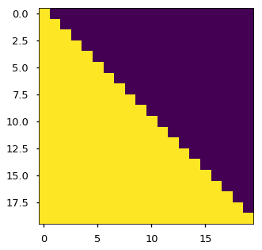

黄色代笔值为1，紫色代表值为0

#### Multi-Head Attention

解码器的Multi-Head Attention与编码器的结构完全一致，只是输入的Q、K、V不同。

**解码器的Multi-Head Attention以编码器最后一层attention模块的K、V为输入K、V，Q为解码器输入计算的。**，在解码过程中K、V不会改变。

#### Linear & Softmax

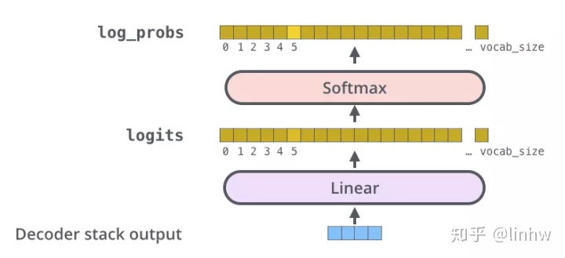

最后通过一个线性层加softmax来预测输出词典中的哪个词。解码器每一步都只解码一个词，输出单词后放入解码器的输入，重复上述操作直到解码到<eos>为止。到这里就完成了句子的输出。