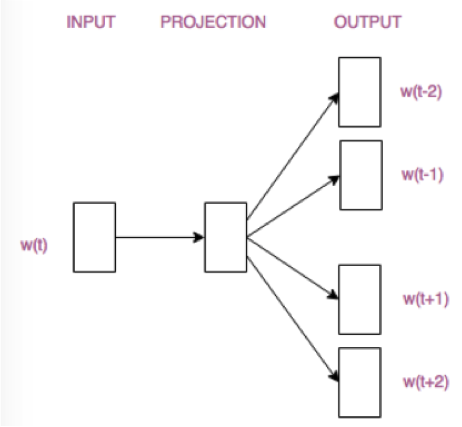

# 词向量

词向量的表示是NLP中的基本任务，最在在NNLM中作为模型的副产物出现，现在对于词向量的研究已经十分全面。

## One-hot Code

表达词向量的最简单的方法就是One-hot编码，形式如下：
$$
[0,...,0,1,0,...,0]
$$
编码的维度与语料库中的总词数相同，且仅有1个维度为1，可看作是表示某个词出现与否，出现则将对应位置置为1。例如：

```
i:      [1, 0, 0, 0, 0]
you:    [0, 1, 0, 0, 0]
like:   [0, 0, 1, 0, 0]
apple:  [0, 0, 0, 1, 0]
banana: [0, 0, 0, 0, 1]
```


这样的编码生成简单，但实际意义不大。one-hot编码存在的缺陷包括：

- 高维度、稀疏：one-hot编码的维度过大，可能会有上万，需要庞大的计算资源。向量中只有1维是非零值，是十分稀疏的
- 缺少语义信息。one-hot编码表示的词无法判断词与词之间的关系，如相似、相反，因为每个向量都是正交的，欧氏距离也相同。

与此one-hot编码只适合做为预处理的输入，不会真正用于表示词向量

## 共现矩阵

为了弥补one-hot编码语义信息的缺失，可以采用共现矩阵的方法。

通过考虑词和词的共现问题，可以反应词之间的语义关系。最简单的方法是使用基于文档的方式来表示词向量，其基本思想是如果两个词经常共同出现在多篇文档中，则说明这两个词在语义上紧密关联。基于文档的词向量可以反应出相关词的语义关系，但是随着文档规模的增大，向量的维度也相应增加，存在维度变化问题。

可以通过统计一个事先指定大小的窗口内单词的共现次数，来解决维度变化问题。这种方法以单词周边的共现词的次数做为当前的词向量。 比如有以下四句话的一个语料库：

```
我\喜欢\摄影
我\爱\运动
我\爱\学习
我\喜欢\画画
```

假设考虑的窗口大小为1，也就是说一个词只与它前面及后面的词相关，比如"我 爱"共现次数为2，则共现矩阵如下所示：


这样，共现矩阵的行(或列)可表示为对应的词向量。如"我"的词向量为[0,2,2,0,0,0,0]。 同时可以知道"爱"，"喜欢"的词向量相似度较高，他们具有相近的意思。

上述矩阵是一个$n\times n$的对称矩阵$X$，矩阵维数随着词典数量n的增大而增大，可以使用**奇异值分解SVD、PCA**将矩阵维度降低。但是仍存在问题：

- 矩阵$X$的维度经常改变
- 由于大部分词并不共现而导致的稀疏性
- 矩阵维度过高带来的高计算复杂度

## 语言模型与神经网络

为了进一步解决词向量的生成问题，可以从语言模型角度入手，在构建语言模型的过程中的到词向量。

### NNLM

nnlm开创了分布式词向量表示的先后，后续许多模型以此为出发点，不断改进模型结构，得到更好的效果。


NNLM在语言模型中已有介绍，这里不再重复。

### Word2Vec

Word2Vec包含2种训练模型，分别是CBOW和Skip-Gram，两者区别在于：

- CBOW模型根据中心词$W(t)$周围（左右两边）的词来预测中心词
- Skip-Gram模型根据中心词$w(t)$预测周围词

两者模型结构仅是输入层和输出层不同。参考文献：https://cs224d.stanford.edu/lecture_notes/notes1.pdf

#### CBOW模型


模型流程

- 输入层：上下文单词的onehot.  {假设单词向量空间dim为V，上下文单词个数为C}

- 所有onehot分别乘以共享的输入权重矩阵W. {V*N矩阵，N为自己设定的数，一般远小于V，初始化权重矩阵W}

- 所得的C个向量 {因为是onehot所以相乘得到的结果维度为$1\times N$} 相加求平均作为隐层向量, size为1*N.

- 乘以输出权重矩阵W' {N*V}

- 得到向量 {1*V} 激活函数处理得到V-dim概率分布  {PS: 因为是onehot嘛，其中的每一维度代表着一个单词}，概率最大的index所指示的单词为预测出的中间词（target word）

- 与true label的onehot做比较，误差越小越好

$V\times N$的矩阵W就是look-up table，将任何一个单词的one-hot编码与w相乘都将得到编码后的低维词向量

#### Skip-Gram模型




### GloVe

### EMLo

### GPT

### Bert

