# 词向量

词向量的表示是NLP中的基本任务，最在在NNLM中作为模型的副产物出现，现在对于词向量的研究已经十分全面。

## One-hot Code

表达词向量的最简单的方法就是One-hot编码，形式如下：
$$
[0,...,0,1,0,...,0]
$$
编码的维度与语料库中的总词数相同，且仅有1个维度为1，可看作是表示某个词出现与否，出现则将对应位置置为1。例如：

```
i:      [1, 0, 0, 0, 0]
you:    [0, 1, 0, 0, 0]
like:   [0, 0, 1, 0, 0]
apple:  [0, 0, 0, 1, 0]
banana: [0, 0, 0, 0, 1]
```


这样的编码生成简单，但实际意义不大。one-hot编码存在的缺陷包括：

- 高维度、稀疏：one-hot编码的维度过大，可能会有上万，需要庞大的计算资源。向量中只有1维是非零值，是十分稀疏的
- 缺少语义信息。one-hot编码表示的词无法判断词与词之间的关系，如相似、相反，因为每个向量都是正交的，欧氏距离也相同。

与此one-hot编码只适合做为预处理的输入，不会真正用于表示词向量

## TF-IDF

TF（Term Frequency，缩写为TF）是词频，即一个词在文中出现的次数，统计出来就是词频TF，显而易见，一个词在文章中出现很多次，那么这个词肯定有着很大的作用，但在统计时需要先将一些无意义的助词（停用词）去除，例如the a and等。TF的计算方式可选择一下任意一种：
$$
TF=某个词出现的次数\\
TF=\frac{某个词出现的次数}{文章的总词数}\\
TF=\frac{某个词出现的次数}{文章中出现最多的词的次数}\\
$$
IDF （Inverse Document Frequency，缩写为IDF）逆文档频率，一个重要性调整系数，衡量一个词是不是常见词。**如果某个词比较少见，但是它在这篇文章中多次出现，那么它很可能就反映了这篇文章的特性，正是我们所需要的关键词。** 因此我们给这样的词一个比较大的权重，即逆文档频率，计算方式如下：
$$
IDF=log(\frac{文档总数}{包含该词的文档数+1})
$$
最后TF-IDF就是TF与IDF的乘积，该值与一个词在文档中的出现次数成正比，与该词在整个语言中的出现次数成反比。


## 共现矩阵

为了弥补one-hot编码语义信息的缺失，可以采用共现矩阵的方法。

通过考虑词和词的共现问题，可以反应词之间的语义关系。最简单的方法是使用基于文档的方式来表示词向量，其基本思想是如果两个词经常共同出现在多篇文档中，则说明这两个词在语义上紧密关联。基于文档的词向量可以反应出相关词的语义关系，但是随着文档规模的增大，向量的维度也相应增加，存在维度变化问题。

可以通过统计一个事先指定大小的窗口内单词的共现次数，来解决维度变化问题。这种方法以单词周边的共现词的次数做为当前的词向量。 比如有以下四句话的一个语料库：

```
我\喜欢\摄影
我\爱\运动
我\爱\学习
我\喜欢\画画
```

假设考虑的窗口大小为1，也就是说一个词只与它前面及后面的词相关，比如"我 爱"共现次数为2，则共现矩阵如下所示：

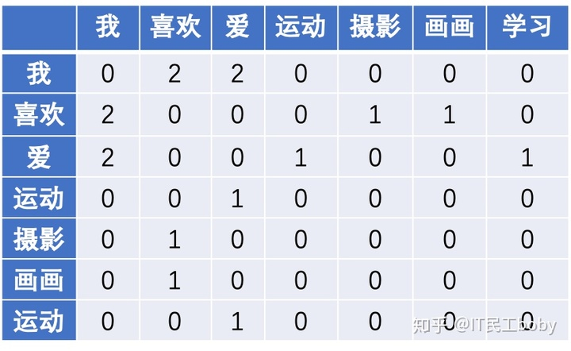

这样，共现矩阵的行(或列)可表示为对应的词向量。如"我"的词向量为[0,2,2,0,0,0,0]。 同时可以知道"爱"，"喜欢"的词向量相似度较高，他们具有相近的意思。

上述矩阵是一个$n\times n$的对称矩阵$X$，矩阵维数随着词典数量n的增大而增大，可以使用**奇异值分解SVD、PCA**将矩阵维度降低。但是仍存在问题：

- 矩阵$X$的维度经常改变
- 由于大部分词并不共现而导致的稀疏性
- 矩阵维度过高带来的高计算复杂度

## 语言模型与神经网络

为了进一步解决词向量的生成问题，可以从语言模型角度入手，在构建语言模型的过程中的到词向量。

### NNLM

nnlm开创了分布式词向量表示的先后，后续许多模型以此为出发点，不断改进模型结构，得到更好的效果。

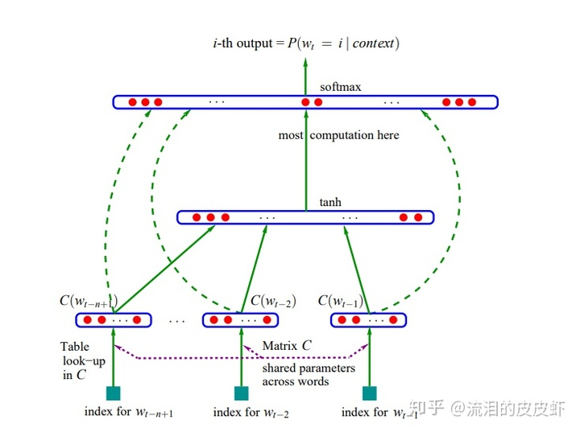

NNLM在语言模型中已有介绍，这里不再重复。

### Word2Vec(2013)

Word2Vec包含2种训练模型，分别是CBOW和Skip-Gram，两者区别在于：

- CBOW模型根据中心词$W(t)$周围（左右两边）的词来预测中心词
- Skip-Gram模型根据中心词$w(t)$预测周围词

两者模型结构仅是输入层和输出层不同。参考文献：https://cs224d.stanford.edu/lecture_notes/notes1.pdf

#### CBOW模型

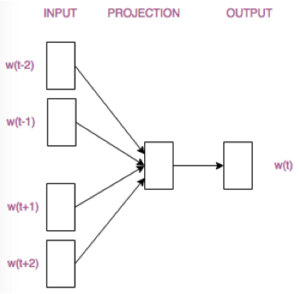

模型流程

- 输入层：上下文单词的onehot.  {假设单词向量空间dim为V，上下文单词个数为C}

- 所有onehot分别乘以共享的输入权重矩阵W. {V*N矩阵，N为自己设定的数，一般远小于V，初始化权重矩阵W}

- 所得的C个向量 {因为是onehot所以相乘得到的结果维度为$1\times N$} 相加求平均作为隐层向量, size为1*N.

- 乘以输出权重矩阵W' {N*V}

- 得到向量 {1*V} 激活函数处理得到V-dim概率分布  {PS: 因为是onehot嘛，其中的每一维度代表着一个单词}，概率最大的index所指示的单词为预测出的中间词（target word）

- 与true label的onehot做比较，误差越小越好

$V\times N$的矩阵W就是look-up table，将任何一个单词的one-hot编码与w相乘都将得到编码后的低维词向量

#### Skip-Gram模型

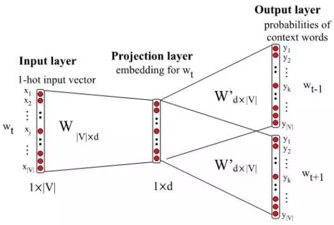

Skip-Gram在生成训练样本时，以中心词为中心，划定一个窗口，并以窗口内的词组成word-pair作为训练样本


skip-gram模型的特点：

- 正样本采样：是一种数据集清洗方式。因为语料中会出现大量的冠词，<question, a>, <question, the>等，这些样本基本上无法为Skip-Gram的重大假设：上下文词语当前词表示接近。因此应当对样本进行重采样，把高频词对频度降低，并且保留低频词对。具体的采样概率服从：
  $$
  P(w_i)=1-\sqrt{\frac{t}{f(w_i)}}
  $$
  其中$f(w_i)$代表词$w_i$的出现频率，t是可以调整的超参数。

- 对于输入的中心词one-hot编码，维度为$1\times |V|$，首先与输入层的嵌入矩阵$W$（维度为$|V|\times d$，词向量查找矩阵）相乘，得到编码后的中心词词向量，维度为$1\times d$，然后再将上下文单次乘以输出层矩阵$W^{'}$，维度为$|V|\times d$（与嵌入矩阵维度相同，但并不是同一个矩阵），得到编码后的上下文词向量，计算2个词向量的logsigmoid损失

- 负采样：用来提高训练速度并且改善所得到词向量的质量的一种方法。不同于原本每个训练样本更新所有的权重，负采样每次让一个训练样本仅仅更新一小部分的权重，这样就会降低梯度下降过程中的计算量。skip-gram使用一元模型分布（unigram distribution）”来选择“negative words”，具体概率为：
  $$
  P(w_i)=\frac{f(w_i)^{3/4}}{\sum_{j=0}^n(f(w_j)^{3/4})}
  $$

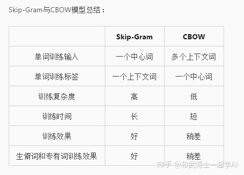


### GloVe(2014)

参考文献：http://web.stanford.edu/class/cs224n/readings/cs224n-2019-notes02-wordvecs2.pdf

- Word2Vec是一种基于局部上下文的预测模型，优点是可以概括比相关性更为复杂的信息，进行word analogy等任务时效果较好，缺点是对统计信息利用的不够充分；

- 共现矩阵以及使用SVD处理共现矩阵的方法属于全局统计模型，优点是训练快速，并且有效的利用了统计信息，缺点是对于高频词汇较为偏向，并且仅能概括词组的相关性。有的时候产生的word vector对于解释词的含义如word analogy等任务效果不好

GloVe（Global Vectors）将两者的优势结合，可以有效的利用全局的统计信息。

首先构造共现概率矩阵（co-occurrence probability matrix），对于矩阵$X$，$X_{ij}$表示单词$j$出现在单词$i$上下文种的次数，$X_i=\sum_kX_{ik}$代表所有出现在单词$i$的上下文中的单词次数，$P_{ij}=P(j|i)=X_{ij}/X_i$代表单词$j$出现在单词$i$上下文中的概率，如图所示：

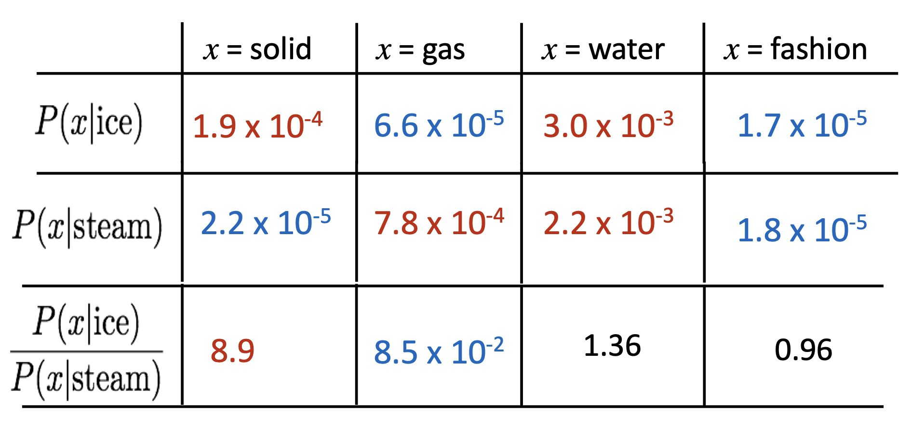

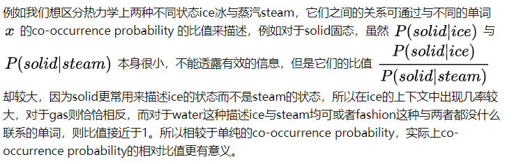

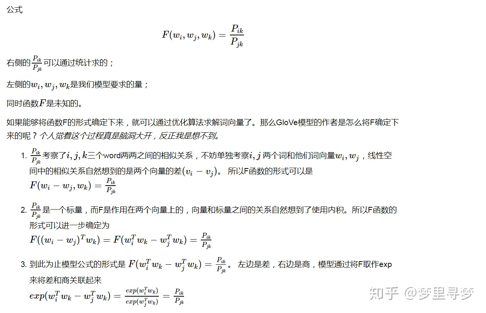

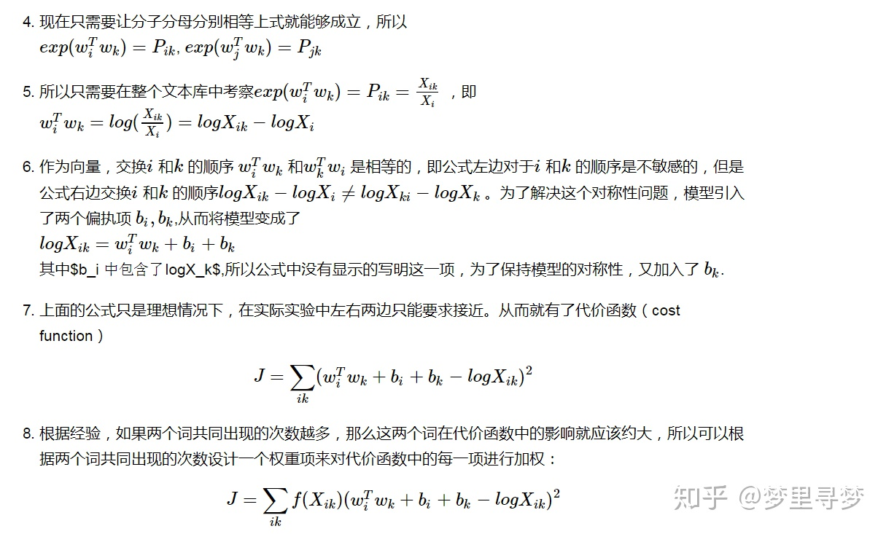

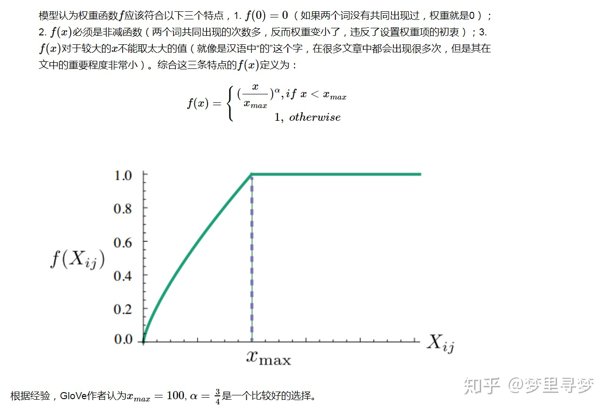

在模型实现时，需要先计算共现矩阵，然后搭建GloVe模型，$w_i,w_k，w_j$这些就是我们需要的词向量。

### ELMo(NAACL18)

之前方法生成的词向量都是静态的，即先针对语料库内的每一个词生成对应的词向量并保存，此类词向量是静态的，生成后不会改变的。然而对于多义词，前文方法并不符合直觉，单词的意思应当结合具体语境分析。

ELMo（Embedding from language models）方法是先预训练一个语言模型，而下游任务所需要的word embedding是通过输入的句子实时输出的，所以词向量是动态生成的。

ELMo采用双向语言模型(biLM)，

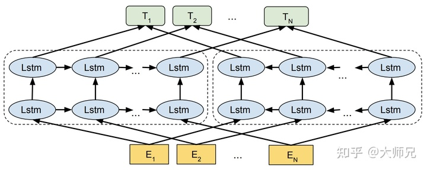

对于给定的$N$个token（字典里的标号），前向语言模型通过前$k-1$个位置的token计算第$k$个token的出现概率：
$$
p(t_1,t_2,...,t_N)=\prod_{k=1}^Np(t_k|t_1,t_2,...,t_k-1)
$$
前向过程如图所示：

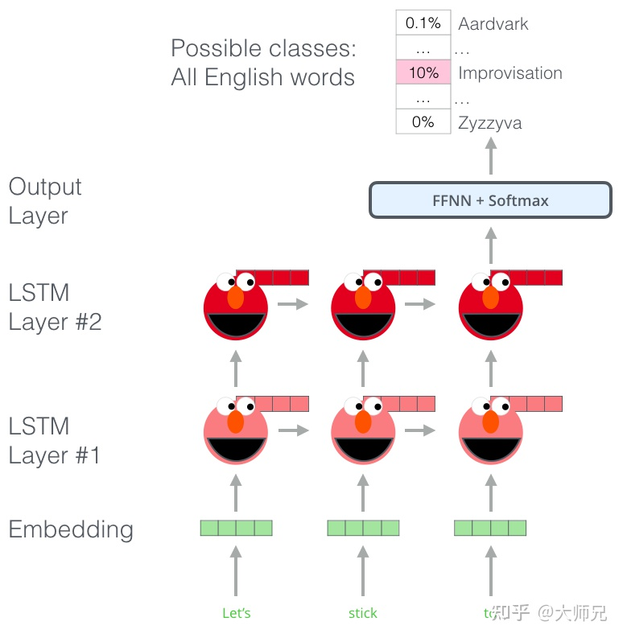

对于前向语言模型，初始lstm层的输入是$x_k^{LM}$，即当前词的token，可由Word2Vec等方式实现。每一层LSTM对于当前输入的$x_k^{LM}$，都会输出$\mathop{h_{k,L}^{LM}} \limits ^{\rightarrow}$，L表示第L层LSTM，而最后一层LSTM的输出会被用于计算第$k+1$个单词。


后向语言模型的计算方法与之类似只是顺序相反，时候第$k$个位置的token后面的单词预测第$k$个token出现的概率：
$$
p(t_1,t_2,...,t_N)=\prod_{k=1}^Np(t_k|t_{k+1},t_{k+2},...,t_N)
$$
对于前向语言模型，初始lstm层的输入是$x_k^{LM}$，即当前词的token，可由Word2Vec等方式实现。每一层LSTM对于当前输入的$x_k^{LM}$，都会输出$\mathop{h_{k,L}^{LM}} \limits ^{\leftarrow}$，L表示第L层LSTM，而最后一层LSTM的输出会被用于计算第$k-1$个单词。

ELMo的目标函数为：

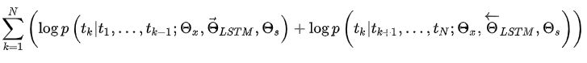

其中$\theta_x$是token embedding，$\theta_s$是输出层的参数

通过最大化正反两个方向的语言模型的最大似然实现模型的目标

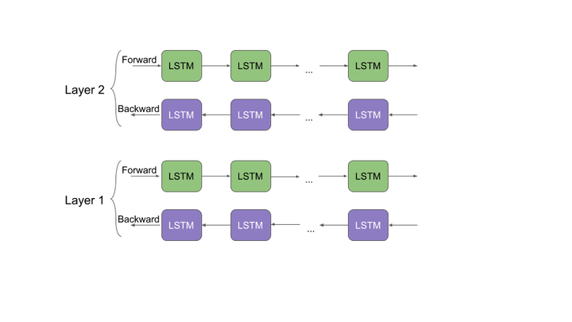

对于一个 $L$层的双向语言模型来说，每个单词是$2L+1$ 个特征向量的结合，他们分别是前向LSTM的 $L$个层的输出，后续LSTM的$L$个输出，以及这个单词的词嵌入：

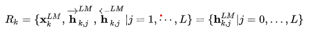

其中当$j=0$是$x_k^{LM}=h_{k,0}^{LM}$,$j>0$时，$h_{k,j}^{LM}=[\mathop{h_{k,L}^{LM}} \limits ^{\rightarrow},\mathop{h_{k,L}^{LM}} \limits ^{\leftarrow}]$, 当将ELMo模型应用到下游任务时，需要使用整合唯一的词向量，一个最简单的方式便是直接取最后一层LSTM的输出作为ELMo生成的嵌入向量，**但是考虑到不同深度的LSTM层表达不同的特征，例如浅层的特征具有更强的句法表达能力，而越深的层则更具有语义表达能力，因此作者提出了根据这个原理，提出了如式所示的使用了任务相关的聚合方式：**

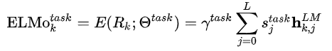

其中$s_j^{task}$是softmax之后的概率，是可以学习的参数，相当于attention。$\gamma^{task}$用于对整个ELMo向量进行按比例缩放，对于不同的任务的优化至关重要

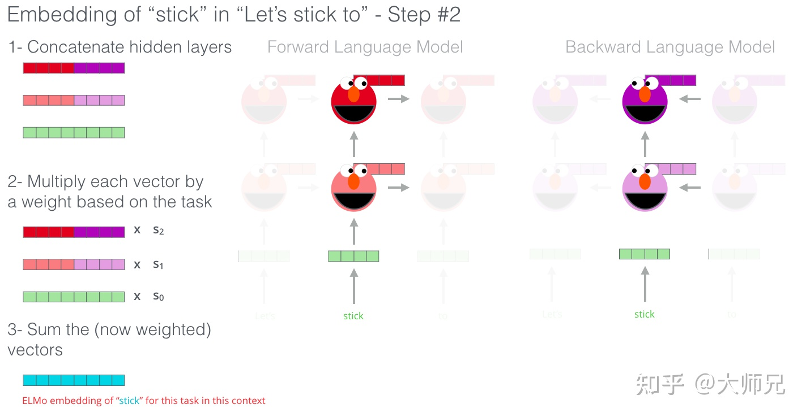

ELMo模型有三个优点：

1. **ELMo具有处理一词多义的能力**。因为ELMo中每个单词的嵌入并不是固定的，在将这个单词的词嵌入输入双向LSTM之后，它的值会随着上下文内容的不同而改变，从而学到了和上下文相关的词嵌入。
2. **ELMo具有不同层次的表征能力**。我们知道，对于一个多层的网络来说，不同的深度具有不同的表征能力，越接近输入层的网络层学到的特征越接近输入的原始特征，而越接近网络输出层的网络层学到的特征则具有很好的语义表征能力。ELMo使用了对多层LSTM的输出进行自适应加权的结构（attention），使用其可以根据下游任务自适应调整ELMo的输出，让其与下游任务相适应。
3. **ELMo具有非常强大的灵活性**：除了ELMo本身的输入可以根据调整外，ELMo还可以以各种形式和下游任务进行结合。通过ELMo得到的仅是当前时间片的输入的编码结果，因此可以加入到输入层，隐层，输出层中。

ELMo是最早的一批将深度学习应用到词向量学习的任务中，它的思想对后续的Bert等产生了巨大的影响。另外使用ELMo的方式觉不仅局限于1.3中所介绍的，读者在使用ELMo时可以自行探索最适合自己任务的结合方式。

参考文献：

[ELMo helps to further improve your sentence embeddings | by Edward Ma | Towards Data Science](https://towardsdatascience.com/elmo-helps-to-further-improve-your-word-embeddings-c6ed2c9df95f)

[Besides Word Embedding, why you need to know Character Embedding? | by Edward Ma | Towards Data Science](https://towardsdatascience.com/besides-word-embedding-why-you-need-to-know-character-embedding-6096a34a3b10)

### GPT

GPT(Generative Pre-Training)，是OpenAI在2018年提出的模型，利用Transformer模型来解决各种自然语言问题，例如分类、推理、问答、相似度等应用的模型。GPT采用了Pre-training + Fine-tuning的训练模式，使得大量无标记的数据得以利用，大大提高了这些问题的效果。

GPT就是利用Transformer进行自然语言各种任务的尝试之一，主要有以下三个要点

- Pre-Training的方式。通过语言模型的方式可以在无标注的语料库进行预训练，生成词向量作为下游任务的输入，提高下游任务的泛化能力。

  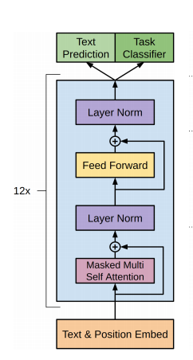

- 单向Transformer模型。GPT使用的Transformer结构就是将Encoder中的Self-Attention替换成了Masked Self-Attention，每个词只能与位置在其之前的词计算相似度。所以GPT使用的语言模型就是ELMo中的前向模型：

  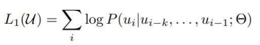

  而训练的过程其实非常的简单，就是将句子n个词的词向量(第一个为<SOS>)加上Positional Encoding后输入到前面提到的Transfromer中，n个输出分别预测该位置的下一个词(<SOS>预测句子中的第一个词，最后一个词的预测结果不用于语言模型的训练，下文会提到)。

- Fine-Tuning与不同输入数据结构的变化。模型训练的第二步，运用少量的带标签数据对模型参数进行微调。上一步中最后一个词的输出我们没有用到，在这一步中就要使用这一个输出来作为下游监督学习的输入（将最后一个输入结构用于分类，回归等具体任务）。为避免Fine-Tuning使得模型陷入过拟合，文中还提到了辅助训练目标的方法，类似于一个多任务模型或者半监督学习。具体方法就是在使用最后一个词的预测结果进行监督学习的同时，前面的词继续上一步的无监督训练。

  此外针对不同任务，需要修改输入数据的格式：

  

  

  

  - Classification：对于分类问题，不需要做什么修改
  - Entailment：对于推理问题，可以将先验与假设使用一个分隔符分开
  - Similarity：对于相似度问题，由于模型是单向的，但相似度与顺序无关。所以需要将两个句子顺序颠倒后两次输入的结果相加来做最后的推测
  - Multiple Choice：对于问答问题，则是将上下文、问题放在一起与答案分隔开，然后进行预测

### Bert

Bert（Bidirectional Encoder Representation from Transformers）模型的思路与GPT相似，使用pretrain+finetune的方式预训练模型

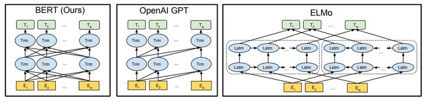

对比GPT模型，Bert采用双向transformer模块，类似双向rnn模块。但不同于ELMo的双向语言模型，分别优化正向反向，Bert模型只训练单一的语言模型。GPT的单向模型是因为使用了mask multi-head attention，bert的双向模型就是直接使用multi-head attention。

#### Input Embedding


Bert输入的嵌入过程是三种方式的和，其中：

- Token Embeddings是词向量，第一个单词是CLS标志，可以用于之后的分类任务
- Segment Embeddings用来区别两种句子，因为预训练不光做LM还要做以两个句子为输入的分类任务
- Position Embeddings和之前文章中的Transformer不一样，不是三角函数而是学习出来的

#### Task 1：Masked Language Model

第一步预训练的目标采用语言模型，Bert采用双向Transformer block是因为如果后续使用预训练模型处理其他任务，那人们想要的肯定不止某个词左边的信息，而是左右两边的信息。

Bert的双向模型不同于ELMo分别训练两个方向的语言模型，Bert是直接训练双向模型，所以传统语言模型的训练方式不能用于Bert。Bert采用的方式与CBOW类似，即用预测词周围（其实是句子内所有词所有）的词来预测，所以训练LM的目标为：
$$
P(w_i|w_1,...,w_{i-1},w_{i+1},...,w_n)
$$
此外，Bert使用mask策略，在训练过程中随机mask句子中15%的token，而不是把像cbow一样把每个词都预测一遍。**最终的损失函数只计算被mask掉那个token。**Mask如何做也是有技巧的，如果一直用标记[MASK]代替（在实际预测时是碰不到这个标记的）会影响模型，所以随机mask的时候10%的单词会被替代成其他单词，10%的单词不替换，剩下80%才被替换为[MASK]。要注意的是Masked LM预训练阶段模型是不知道真正被mask的是哪个词，所以模型每个词都要关注。

#### Task 2： Next Senetence Prediction

因为涉及到QA和NLI之类的任务，增加了第二个预训练任务，目的是让模型理解两个句子之间的联系。训练的输入是句子A和B，B有一半的几率是A的下一句，输入这两个句子，模型预测B是不是A的下一句。预训练的时候可以达到97-98%的准确度。

#### Finetune

与GPT类似，对于不同的任务，Bert模型输入输出的数据结构需要进行一些调整。如图所示：

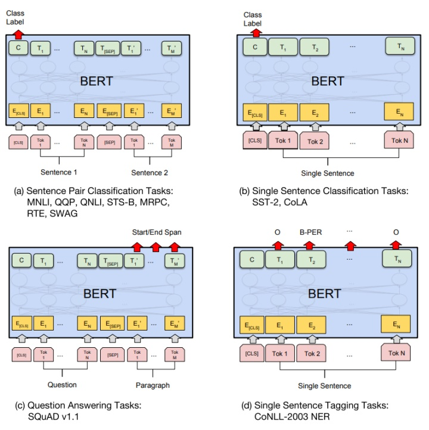