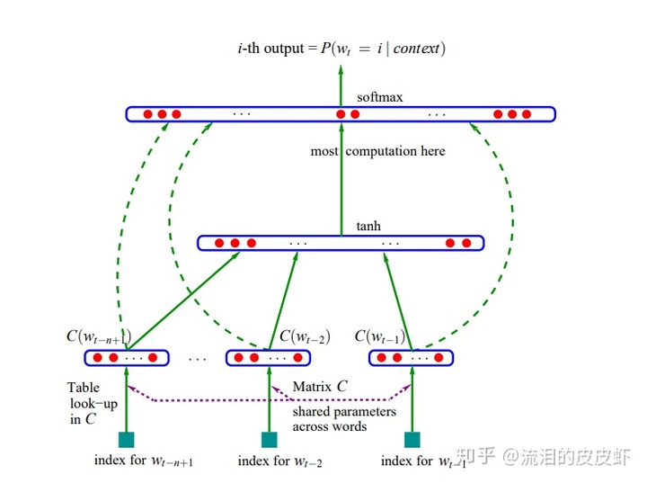

# 语言模型

语言模型用于计算一个给定句子合理（文字组合是否常见）的概率，对于一个语句$w_1,w_2,...,w_k$，语言模型计算的概率$P(w_1,w_2,...,w_k)$在区间$[0,1]$之间，值越大表示句子越合理。

语言模型可分为统计语言模型和神经网络语言模型两种。

## 统计语言模型

对于语句$S=w_1,w_2,...,w_k$，一种直观的概率计算方法是
$$
P(S)=P(w_1,w_2,...w_k)=P(w_1)P(w_2|w_1)...P(w_k|w_1,w_2,..,w_k-1)
$$
这中计算方式包含明显的问题：

- 参数空间大：最后几项的条件可能性很多，无法计算
- 数据稀疏：很多长词对组合在语料库中很少见，由此得到的概率会趋向于0，失真

### 马尔可夫假设与n-gram模型

为了解决上述问题，人们引入了马尔可夫链假设，即当前词出现的概率只和其前面有限的n-1项相关。基于此假设的模型为n-gram语言模型（n元语言模型），一般n取1（uni-gram 1元语言模型）或2（bi-gram 2元语言模型），当n大于4时，n-gram模型的优势就不明显了。

与2元语言模型为例，其计算过程如下：
$$
P(S)=P(w_1,w_2,...,w_k)\approx P(w_1)P(w_2|w_1)P(w_3|w_2)...P(w_k|w_{k-1})
$$
对于n-gram语言模型中的一项$P(w_{i+1}|w_{i-k},...,w_i)$
$$
P(w_{i+1}|w_{i-k},...,w_i)=\frac{\#(w_{i-k},...w_{i+1})}{\sum_{w_j}\#(w_{i-k},...,w_i,w_j)}=\frac{\#(w_{i-k},...w_{i+1})}{\#(w_{i-k},...,w_i)}
$$
其中$\#()$表示该词对出现的次数，第一个等式后的式子表示条件概率的计算过程，第二个等式为推论公式。

当n-gram模型的n取大于1的值时，通常会给原始词词序列加上一个或多个起始符$<s>$，因此句首的词也能计算$P(w_1|<S>,...,<S>)$，让形式统一。

此外还会在句尾添加一个结束符$</s>$，**式3成立的原因也是因为存在结束符，如果没有结束符存在，n-gram模型只能计算固定长度的句子，而不是任意长度的序列(即 式3的第二个等式不成立)**

### 平滑技术与Back-off

观察式3的计算过程会发现，当分母上的词对没有出现时（未登录词<OOV>），语言模型的中这一项是无法计算的，这也是自然语言处理的一大痛点。为了解决此问题，有2种处理方法：

- 平滑技术：在分母上加上常数使其不可能为0
- back-off：如果分母上的词对没有出现过，则可以估计n-gram这一项的值，例如用n-1-gram估计该项n-gram的值，back-off的方法很多，可以自行了解

### 困惑度评价方法

语言模型的评价可采用困惑度perplexity计算：
$$
Perplexity=2^{-l}\\
l=\frac{1}{m}\sum_{i=1}^mp(x)log\;p(x)
$$
此时困惑度可以理解为语言模型在计算词对的混乱程度，取值范围在$[1,+\infin]$。当一个词对越混乱，其困惑度越高，语言模型的效果越差。

另一种困惑度的定义方法是：
$$
Perplexity(S)=P(w_1,w_2,...,w_k)^{-\frac{1}{n}}=\sqrt[n]{\prod_{i=1}^n\frac{1}{p(w_{i+1}|w_{i-k},...,w_i-1)}}
$$
此时困惑度可以理解为平均分支系数（average branching factor），即模型预测下一个单词时的平均可选择的单词数量，取值范围在$(0,+\infin]$。与之前相同，当一个词序越不合理，其困惑度就越大。

在比较不同的语言模型时，通常使用模拟真实环境的正常句子作为测试样例，计算样例在不同语言模型下的困惑度，困惑度越小表示语言模型效果越好。

### 统计方法的缺陷

基于统计方法的语言模型理论简单易懂，但也面临以下挑战：

- 计算复杂度大。对于一个词表规模为V的语料库而言，n-gram模型计算数目为$|V|^n$,当n变化时，计算量是指数级变化的。
- 人工设计的规则变化很多，但效果不一。平滑技术、back-off等方法有多种选择，但哪一种是最合适还未有定论。此外，困惑度评价体系本身也不是一个完美的评价方法
- 统计方法比较死板。原始语料库中未出现的词对会被判断为不合理词对，影响模型的估计，因此模型显得比较保守。但从另一方面来看，这种保守虽然降低了召回率，但却能保持较高的精度。

## 神经网络语言模型

观察n-gram语言模型中的一项：
$$
P(w_{i+1}|w_{i-k},...,w_i)
$$
可以理解为在给定一个n-1长度的序列后预测下一词为$w_{i+1}$的概率，这也是神经网络语言模型的本质。

### NNLM

2003年Bengio的文章**A Neural Probabilistic Language Model**是第一篇使用神经网络搭建语言模型的文章。NNLM模型的主要任务是利用给定的前n-1个词汇预测第n个词汇。此外这篇文章也第一次提出了**词向量概念：使用低维、稠密、连续的向量表达文本**

**输入层**：以n-1个单词的one-hot编码为输入，每个one-hot编码为$|V|$维，V为词表大小（词汇总数量），one-hot编码的形式为：
$$
[0,....,0,1,0,...,0]
$$
这稀疏的高维编码会与维度为$|V|\times m$的embedding矩阵C相乘，每个one-hot编码在相乘后变为维度为m（m远小于|V|）的分布向量（distribution vector），实现降维目的。因此矩阵C可看作是一个查找表，存储了对应词汇的**词向量**，当有词汇输入时，更具one-hot编码的形式提取出对应的行向量作为词向量。矩阵C在训练阶段由反向传播所发不断优化，提升表达能力。

这里作为副产物诞生的词向量（分布式词向量）相比one-hot编码有明显的优势，能够体现词与词之间的相似度。

**隐含层**：在得到n-1个词向量后，为了便于后续的计算，先将他们concat在一起，得到$n(m-1)\times 1$的向量x

隐含层的计算为简单的全连接，激活函数为tanh，计算过程为：
$$
hidden=tanh(Hx+d)
$$
矩阵H的维度为$h\times (n-1)m$，d维度为$h\times 1$

**输出层**：利用了隐含层的输出以及原始合并词向量，最后套上softmax, 其公式为：
$$
y=b+Wx+Utanh(Hx+d)\\
p(w_t|w_{t-1},...,w_{t-n+1})=\frac{e^{y_{w_t}}}{\sum_{i=1}^{n-1}e^{y_{w_i}}}
$$
其中矩阵U维度为$|V|\times h$，矩阵W维度为$|V|\times (n-1)m$，b维度为$|V|\times 1$,输出层预测了此表内每个词作为前n-1个词的后文的概率。

**损失函数**：
$$
L=\frac{1}{T}\sum_t log\;p(w_t|w_{t-1},...,w_{t-1+n})+R(\theta)
$$
其中$R(\theta)$是模型的正则项，$p(w_t|w_{t-1},...,w_{t-1+n})$是模型softmax的输出项。实验证明NNLM的性能比n-gram的算法好10%-20%

### RNNLM

Mikolov 以Bengio论文中的提示为基础，用循环神经网络做语言模型并在 INTERSPEECH 2010 上发表《Recurrent neural network based language model》

由于循环神经网络多用在时序序列上，因此里面的输入层、隐藏层和输出层都带上了“(t)”。$w(t)$ 是句子中第 t 个词的 One-hot 向量，里面只有一个元素是 1。而下面的 $s(t−1)$ 向量就是上一个隐藏层。最后隐藏层计算公式为：
$$
s(t)=sigmoid(Uw(t)+Ws(t-1))
$$
从右图可以看出循环神经网络是如何展开的。每来一个新词，就和上一个隐藏层联合计算出下一个隐藏层，隐藏层反复利用，一直保留着最新的状态。各隐藏层通过一层传统的前馈网络得到输出值。

　　$w(t)$ 是一个词的 One-hot向量，那么 $Uw(t)$ 也就相当于从矩阵 U 中选出了一列，这一列就是该词对应的词向量。

　　循环神经网络的最大优势在于，可以真正充分地**利用所有上文信息**来预测下一个词，而不像前面的其它工作那样，只能开一个 n 个词的窗口，只用前 n 个词来预测下一个词。从形式上看，这是一个非常“终极”的模型，毕竟语言模型里能用到的信息，他全用上了。可惜的是，循环神经网络形式上非常好看，使用起来却非常难优化，如果优化的不好，长距离的信息就会丢失，甚至还无法达到开窗口看前若干个词的效果。Mikolov 在 RNNLM 里面只使用了最朴素的 BPTT 优化算法，就已经比 n-gram 中的 state of the art 方法有更好的效果，这非常令人欣慰。如果用上了更强的优化算法，最后效果肯定还能提升很多。

对于最后隐藏层到输出层的巨大计算量，Mikolov 使用了一种分组的方法：根据词频将$|V|$ 个词分成 $\sqrt{|V|}$ 组，先通过$\sqrt{|V|}$ 次判断，看下一个词属于哪个组，再通过若干次判断，找出其属于组内的哪个元素。最后均摊复杂度约为$o(|\sqrt{V|})$，略差于 M&H 的 $o(log⁡(|V|))$，但是其浅层结构某种程度上可以减少误差传递，也不失为一种良策。

### 重点转移

随着DL的发展，后续对于语言模型的建立将重点转移至了词向量，甚至是其他NLP任务，如词性标注、命名实体识别等，如何不建立语言模型也能完成这些任务成了后续研究的重点。

## 参考文献：

https://zhuanlan.zhihu.com/p/84338492

http://licstar.net/archives/328#s21