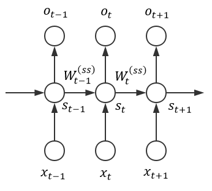
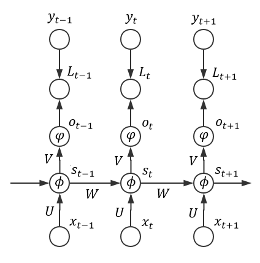

# RNN结构

## 1.RNN出现的原因

传统神经网络只能单独的取处理一个个的输入，前一个输入和后一个输入是完全没有关系的。但是，某些任务需要能够更好的处理序列的信息，即前面的输入和后面的输入是有关系的。

在自然语言处理、时序信号处理中十分常用

## 2. RNN结构

RNN的结构很简单，包括输入$X_t$、RNN层$A$、输出$h_t$,$t$表示时间序列。RNN层以以当前时刻的输入$X$和上一时刻RNN层的输出为输入，如果将上述网络结构展开，则结构更加明显：

这种像是链状的网络结构表明RNN和序列以及列表有着天然的联系，他们是处理这些序列数据的天然的神经网络。而且很明显我们可以看出，输入输出的序列是具有相同的时间长度的，其中的每一个权值都是共享的（都是相同的A，只是A的输入有所区别）

## 3. RNN计算过程

### 3.1 前向传播

RNN的前向传播计算过程如下：
$$
\begin{align}
s_t&=tanh(Ws_{t-1}+Ux_t)\\
o_t&=sigmoid(Vs_i)
\end{align}
$$

### 3.2 反向传播

