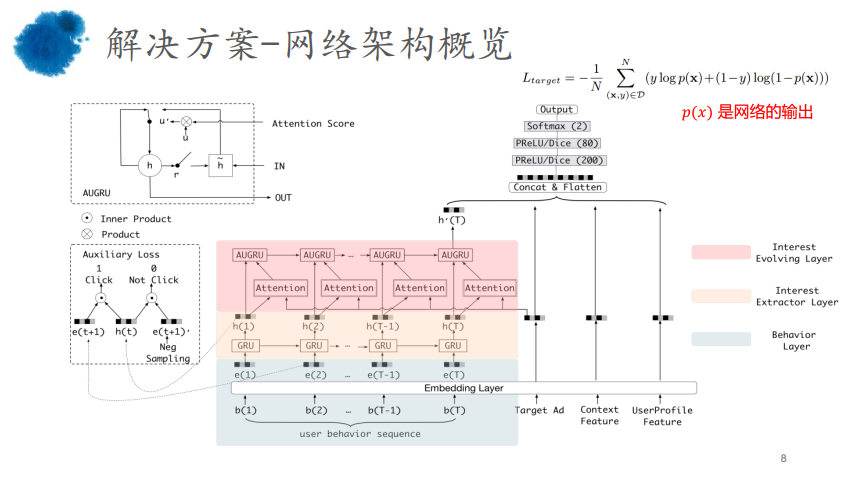
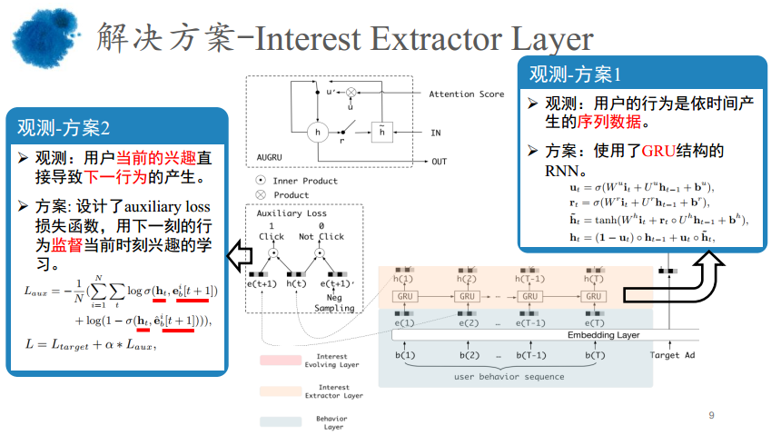
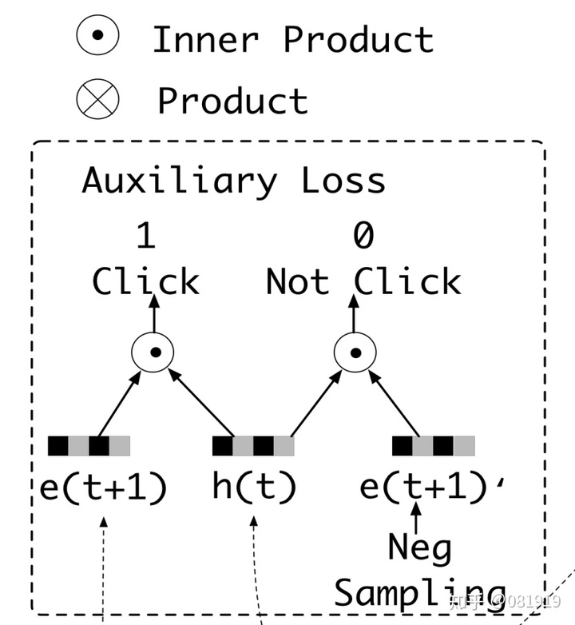
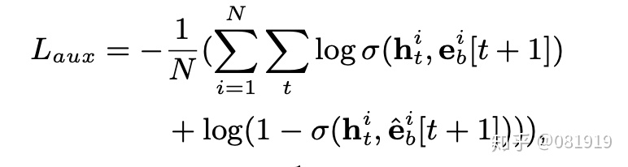
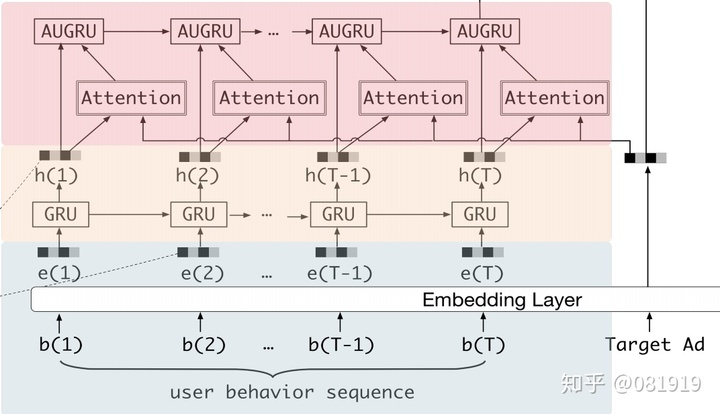
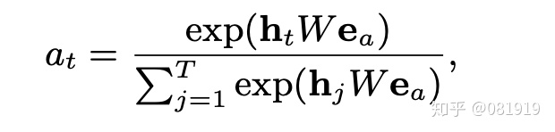
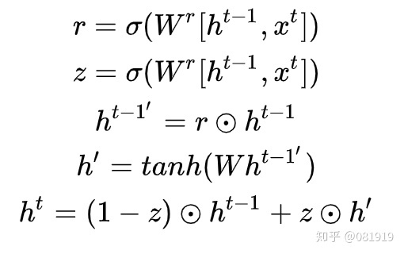
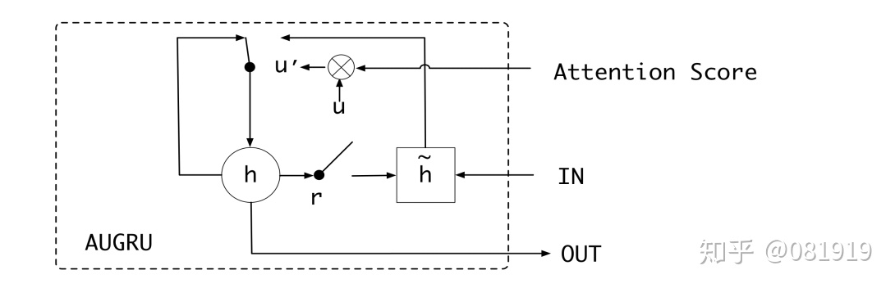
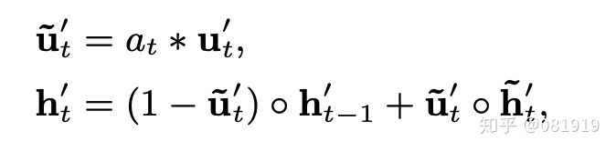

# Deep Interest Evolution Network

## 研究任务与现存问题

这篇来自阿里妈妈团队的论文主要研究的是推荐系统里CTR（click-through rate）预测任务。CTR预测任务是指在给定用户的一系列历史浏览数据后，判断用户是否会点击某个潜在的item。DIEN是在DIN的基础上进一步改进。

现有的CTR预测以深度学习模型为主，但这些方法（包括DIN）存在的问题有：

- 忽略隐式特征的挖掘和表示。行为是兴趣的载体，能反映兴趣，但若直接用行为表示兴趣则略有不妥。因为，行为是序列化产生的，如果像大部分现有的模型那样直接采用行为即兴趣的做法，会忽略行为之间的依赖关系。此外，当前时刻的兴趣往往直接导致了下一行为的发生。
- 忽略兴趣的变化。用户的兴趣是不断变化的。例如用户对衣服的喜好，会随季节、时尚风潮以及个人品味的变化而变化，呈现一种连续的变迁趋势。但在淘宝平台中，用户的兴趣是丰富多样的，且每个方向（穿衣，运动，食物等）的兴趣的演变基本互不影响。此外，影响最终行为的仅仅是与目标商品相关的兴趣。

## 创新点

- 作者以DIN为基础设计了DIEN模型，其特点在于用behavior layer、interest extractor layer 以及 interest evolving layer从用户历史行为中挖掘用户与目标商品相关的兴趣及演变

- 优化的目标损失函数采用的是负对数似然（negative log-likelihood loss ）

## 模型结构

模型的整体结构如图所示：

相比于DIN模型，DIEN模型仍然对用户历史行为部分进行改进。在DIN模型中，用户历史行为数据是multi-hot编码，如[0,1,1,0,0,1]，编码长度与物品总数相同。DIEN模型中，用户历史行为数据是一组one-hot编码序列，表示用户按顺序点击的物品。

#### Interest Extractor Layer

在 interest extractor layer 用 GRU 结构的 RNN对依时间产生的序列行为建模，捕捉行为之间的依赖，生成的 interest state。但直接使用GRU结构会存在以下问题：

- 在获取时序上用户兴趣表示的时候其实是将GRU的hidden states作为用户当前的一个interests，但是这个vector其实是缺少监督信息的，我在计算GRU的loss时只有最后时刻的输出才会得到target的反应，也就是最后作为target的那个点击行为
- GRU是用来获取不同时间行为的依赖性的，也就是说在时间序列上如果行为之间有很好的关联依赖性，那么GRU可以发挥很好的效果，但是对于用户行为来说可能在短时间内的就会有很多的点击行为，而且这些点击行为之间没有很好的依赖性，就比如我先点击一个衣服，又点击了一个猪饲料，依赖性不强

针对第一点，作者使用辅助损失函数解决这个问题。

e(t+1)是在t+1时刻用户点击的goods的embedding，h(t)是用户在t时刻GRU的hidden stats，e(t+1)'是经过负采样的用户没有点击的goods，这样就一目了然了，h(t)代表了模型预测用户在t+1时刻的interests，而e(t+1)则是用户在t+1时刻真实的interests，这样做一个inner product 来计算相似度，外边再加一层sigmoid，就得到了auxiliary loss，公式如下：

为了解决第二个问题，作者设计了新结构：

#### Interest Evolving Layer

用户在时间序列上的行为可能是相互独立的，也就是说，我在这一天可能看了一些衣服，第二天可能去看了电脑，但是这样来看RNN这种能够捕获时序依赖关系的网络结构，可能表现就不是很好，所以，我们就只关注与target相关的兴趣，举个例子，比如我的target是一件衣服，而我通过观察用户时间序列上点击衣服的行为就可以学到他对于衣服这类商品的兴趣进化，所以，DIEN使用了attention的机制，同样是和DIN一样使用attention，但是方式略有不同。

DIEN的attention机制是基于GRU网络实现的，首先计算每个隐藏状态ht对应的权重at：

W是一个连接矩阵， 注意这里的$e_a$不是某个物品的嵌入向量，而是在用户行为中属于这一cate_id的物品的嵌入向量的拼接结果， 相比于DIN的attention，因为是时序的原因这里的权重做了归一化处理。

再计算出权重at后，作者使用AUGRU建模兴趣进化的过程。首先传统GRU的计算方式如下：

而作者设计的AUGRU的计算过程和结构如下所示（其实只是添加了一个at，其他部分没有任何变化，但是可以实现让时序中跟target不相近的vector给弱化掉，能够达到对于target兴趣进化的行为提取）：

