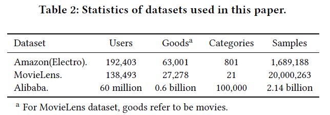
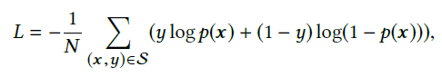
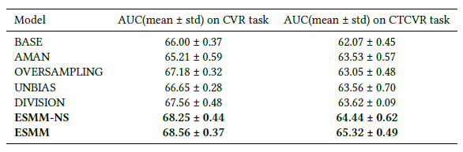
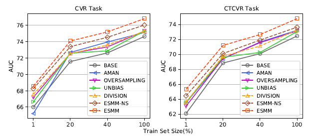

# Deep Interest Network

## 研究任务与现存问题

这篇来自阿里妈妈团队的论文主要研究的是推荐系统里CTR（click-through rate）预测任务。CTR预测任务是指在给定用户的一系列历史浏览数据后，判断用户是否会点击某个潜在的item。

现有的CTR预测以深度学习模型为主，但这些方法普遍一个问题：

- 无论待推荐的item如何变化，用户的所有历史浏览数据被编码成一个固定长度的向量，即无论candidate item怎么变化，用户的历史浏览数据编码过程是不变的。现有模型在处理这类情况时，将用户的历史数据分别嵌入到向量空间并拼接，最后使用average pooling将特征平均并变换到固定长度，便于后续全连接层推理。但是考虑如下的情景：

  

  当推荐的item是一件女士羽绒大衣时，用户历史浏览数据包含的棉大衣等是主要依据，类似杯子、手袋等都是次要因素。此时使用average pooling和固定大小的特征向量并不能很好反映用户。

- 由于训练数据的稀疏性，训练工业级的推荐系统比较困难。在大规模稀疏场景下，L2正则的计算开销会很大。

## 创新点

- 作者提出了一个Deep Interest Network用于CTR预测任务。DIN网络中的local activation unit将根据带推荐的item动态调整用户的不同历史行为数据的权重，生成更有效的用户行为向量。

- 作者设计了2种模型训练方法：mini-batch aware regularization以及自适应激活函数Dice

- 提供了一个公共数据集，与现有数据集的对比如下：

  

## 模型结构

如上图所示，ESMM包括左右2个子网络，且这两个子网络的嵌入层是共享的，因此两个子网络的唯一区别在于多层感知器部分。子网络的具体实现可以参考现有研究，ESMM主要贡献在于这个多任务学习的框架。

左侧子网络输入的是预测的CVR值，右侧子网络先输出预测的CTR值，再乘以预测的CVR，得到CTCVR值。这里存在一个隐含的问题，即为什么不直接预测CTR，CTCVR，然后通过除法得到CVR？如下所示

作者认为这样的除法操作是不合适的。首先CTR通常很小，作为分母可能会导致数值计算不稳定；另外这样的除法操作并不能保证CVR的取值范围在[0,1]。

模型的损失函数采用交叉熵实现。分别对CTR、CTCVR计算损失：

这里没有对CVR直接施加监督信号，这样可以有效避免DS问题。

## 实验对比

- 作者选择AUC评价模型性能

- 作者在公共数据集上对比了下列模型的性能

  - BASE：直接实验点击数据训练CVR预测模型
  - AMAN：从unclicked样本中随机抽样作为负例加入点击集合
  - OVERSAMPLING：对点击集中的正例（转化样本）过采样
  - UNBIAS：使用rejection sampling
  - DIVISION：分别训练CTR和CVCTR，相除得到pCVR
  - ESMM-NS：ESMM结构中CVR与CTR部分不share embedding

  

  

作者通过采样的方式表明Data Sparsity问题对模型性能的影响:

