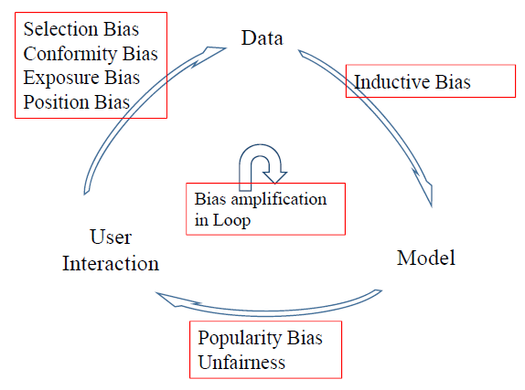
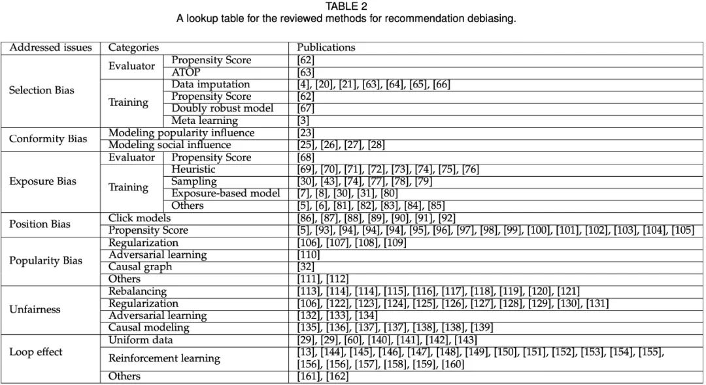

# 推荐系统 

## 推荐系统整体架构

工业级推荐系统可分为在线部分，近线部分和离线部分。具体而言：

- **离线部分**（不用实时数据，不提供实时服务），通过对线上用户点击日志的存储和清理，整理离线训练数据，并周期性地更新推荐模型。对于超大规模数据和机器学习模型来说，往往需要高效地分布式机器学习平台来对离线训练进行支持。

- **近线部分**（使用实时数据，不保证实时服务），主要目的是实时收集用户行为反馈，并选择训练实例，实时抽取拼接特征，并近乎实时地更新在线推荐模型。这样做的好处是用户的最新兴趣能够近乎实时地体现到推荐结果里。（例如使用实时数据，小批量梯度下降更新模型参数）

- **在线部分**（使用实时数据，要保证实时服务），首先通过**召回**环节，将给用户推荐的物品降到千以下规模；然后进入**排序**阶段，如果召回阶段返回的物品还是太多，可以加入粗排阶段，这个阶段是可选的，粗排可以通过一些简单排序模型进一步减少往后续环节传递的物品；再往后是精排阶段，这里可以使用复杂的模型来对少量物品精准排序。对某个用户来说，即使精排推荐结果出来了，一般并不会直接展示给用户，可能还要上一些业务策略，比如去已读，推荐多样化，加入广告等各种业务策略。之后形成最终推荐结果，将结果展示给用户。

  

  更具体地，离线、近线、在线部分的划分可参照下图：

  

由此可见，一个完整的推荐系统包含召回、排序两个阶段，而排序阶段又可分为粗排序、精排序、重排序3个环节。

## Recall召回阶段

从千万量级的候选物品里，采取简单模型将推荐物品候选集合**快速筛选**到千级别甚至百级别，这样将候选集合（即给用户推荐的物品）**数量降下来**，之后在排序阶段就可以上一些复杂模型，细致地对每个候选集进行个性化排序。

召回阶段一般为了保证模型的运行速度和泛化能力，尽量选择简单模型。目前常用的召回策略是多路召回，如下图所示：

目前工业界的推荐系统，在召回阶段，一般都采取多路召回策略。上图展示了一个简化版本的例子，以微博信息流排序为例，不同业务召回路数不太一样，但是常用的召回策略，基本都会包含，比如兴趣标签，兴趣Topic，兴趣实体，协同过滤，热门，相同地域等，多者几十路召回，少者也有7／8路召回。对于每一路召回，会拉回K条相关物料，这个K值是个超参，需要通过线上AB测试来确定合理的取值范围。

主流的召回方法主要有两大类，一个是基于统计的启发式召回，如协同过滤、swing i2i，利用item共现性，进行相关召回。另一个是基于深度学习的向量召回方法，如MIND、DSSM、GNN等将user、item表示成向量，利用设定好的距离度量方法，通过向量检索召回top-K item。各路召回的item将送入排序阶段进一步筛选。

## Ranking排序阶段

在召回阶段，多路召回的内容是不具有可比性的，并且因为数据量太大也难以进行更加较精确的偏好和质量评估，因此需要在排序阶段对召回结果进行统一的准确的打分排序。常用的排序算法框架可分为以下三种：（进一步可参考[连接](https://blog.csdn.net/rosefun96/article/details/103873917)）

- pointwise，给定一个训练item，输出预测的得分/概率。典型的pointwise应用是CTR估计。pointwise类模型包括：LR、MLR、GBDT+LR、FM、DIN、Wide&Deep、DeepFM、DCN、CrossNetwork、DIEN、DSSM等
- pairwise，给定一组有序样本对，输出预测得分/概率。Pairwise模型将排序问题归为二元分类问题，常用的模型包括RankNet、XGBoost+pairwise、LambdaFM等
- listwise，给定一组有序样本序列，输出预测得分/概率

https://zhuanlan.zhihu.com/p/113302654?from_voters_page=true

## 冷启动问题

新开发的产品，初期用户很少，用户行为也不多，常用的协同过滤、深度学习等依赖大量用户行为的算法不能很好的训练出精准的推荐模型, 怎么让推荐系统很好的运转起来，让推荐变得越来越准确，这个问题就是系统冷启动。

推荐系统冷启动主要分为物品冷启动、用户冷启动、系统冷启动三大类。解决冷启动问题会面临如下挑战：

- 对于新的物品，我们也不知道什么用户会喜欢它，只能根据用户历史行为了解用户的真实喜好，当很多时候物品的信息不完善、包含的信息不好处理、数据杂乱，或者是新物品产生的速度太快(如新闻类，一般通过爬虫可以短时间爬取大量的新闻)，短时间类来不及处理或者处理成本太高，或者是完全新的品类或者领域，无法很好的建立与库中已有物品的联系，所有这些情况都会增加将标的物分发给喜欢该标的物的用户的难度。

- 对新用户知之甚少， 所以基本不知道用户的真实兴趣，从而很难为用户推荐他喜欢的物品

- 对于新开发的产品，由于是从零开始发展用户，冷启动问题就更加凸显，这时每个用户都是冷启动用户，面临的挑战更大。

  

解决冷启动的一般思路，这些思路是帮助我们设计冷启动方案的指导原则。具体思路有如下7个(括号里面代表适用于哪类冷启动)：

1. 提供非个性化的推荐(用户冷启动)
2. 利用用户注册时提供的信息(用户冷启动、系统冷启动)
3. 基于内容做推荐(用户冷启动、系统冷启动)
4. 利用标的物的metadata信息做推荐(物品冷启动)
5. 采用快速试探策略(用户冷启动、物品冷启动)
6. 采用兴趣迁移策略(用户冷启动、系统冷启动)
7. 采用基于关系传递的策略(物品冷启动)

更多内容可以参考[链接](https://zhuanlan.zhihu.com/p/79950668)

## Bias以及Debias

大多数论文致力于开发机器学习模型来更好地拟合用户行为数据。然而，用户行为数据是观察性的，而不是实验性的。这里面带来了非常多的偏差,典型的有：选择偏差、位置偏差、曝光偏差和流行度偏差等。如果不考虑固有的偏差，**盲目地对数据进行拟合，会导致很多严重的问题，如线下评价与在线指标的不一致,损害用户对推荐服务的满意度和信任度等，**

偏差Bias通常来自不同的数据分组，并使推荐模型捕捉到这些偏差，甚至对其进行缩放，从而导致系统性种族主义和次优决策。在上图推荐系统的循环过程中，数据偏差可分为四类：外显反馈中的选择偏差和从众偏差，内隐反馈中的暴露偏差和位置偏差。

针对这些偏差，现有的去偏差方法有：

具体可参考论文：Bias and Debias in Recommender System: A Survey and Future Directions

