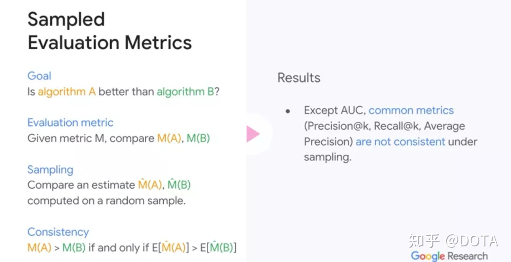
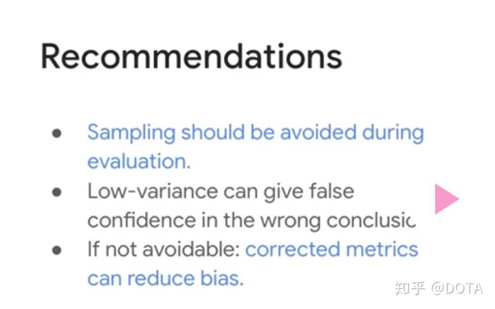

# 推荐算法评价指标

## 1. MAP

MAP（Mean Average Precision）常用于排序任务，MAP的计算涉及另外两个指标：Precision和Recall

### 1.1 Precision和Precision@k

推荐算法中的精度precision计算如下：
$$
precision=\frac{算法结果中相关的item数量}{推荐的item总数量}
$$
可以看出Precision的计算没有考虑结果列表中item的顺序，Precision@k则通过切片的方式将顺序隐含在结果中。Precision@k表示列表前k项的Precision，随着k的变化，可以得到一系列precision值，用$P(k)$表示。

### 1.2 Recall和Recall@k

推荐算法中的召回率recall计算如下：
$$
recall=\frac{算法结果中相关的item数量}{所有相关的item数量}
$$
与Precision@k相似，recall@k表示结果列表前k项的recall，随着k的变化，可以得到一系列的recall值，用$r(k)$表示。

### 1.3 AP@N

AP（Average Precision）平均精度的计算以Precision@k为基础，可以体现出结果列表中item顺序的重要性，其计算过程如下：
$$
AP@N=\frac{1}{m}\sum^N_{k=1}(P(k)\quad if\quad kth\quad item\quad is\quad relevant)=\frac{1}{m}\sum^N_{k=1}P(k)\cdot rel(k)
$$
其中，N表示要求推荐的N个item，m表示所有相关的item总数，$rel(k)$表示第k个item是否相关，相关为1，反之为0

**AP@N的值越大，表示推荐列表中相关的item数量越多以及相关item的排名越靠前**

此外，AP@N的计算还存在多种不同的变体，具体可以参考[链接](http://sdsawtelle.github.io/blog/output/mean-average-precision-MAP-for-recommender-systems.html#MAP-for-Recommender-Algorithms)

### 1.4 MAP@N

AP@N评价了算法对单个用户的性能，MAP@N则是算法对多个用户的平均值，是平均数的平均，其计算过程如下：
$$
MAP@N=\frac{1}{|U|}\sum_{u=1}^{|U|}(AP@N)_u=\frac{1}{|U|}\sum_{u=1}^{|U|}(\frac{1}{m}\sum^N_{k=1}P_u(k)\cdot rel_u(k))
$$

## 2.  MRR

平均倒数排名（Mean Reciprocal Rank）是一种通用的搜索、推荐算法的评价机制。其数学形式为：
$$
MRR=\frac{1}{Q}\sum^{|Q|}_{i=1}\frac{1}{rank_i}
$$
其中$|Q|$表示用户个数，$rank_i$表示对于第$i$个用户，推荐列表中的结果中第一个有效值所在的位置。[示例参考](https://blog.csdn.net/jiangjiang_jian/article/details/108246103)

## 3. NDCG

归一化折损累计增益（Normalization discounted cumulative gain）也常用于排序任务，与MAP不同的是，NDCG考虑到排序列表中每个item的评分大小，而MAP仅考虑相关/不相关的1，0值排序。具体例子可[参考](http://sofasofa.io/forum_main_post.php?postid=1002561)

### 3.1 CG@k

CG（cumulative gain）累计增益，可用于评价基于评分的推荐系统，列表前k项的计算过程如下：
$$
CG@k=\sum_{i=1}^krel_i
$$
与MAP不同，这里的$rel_i$不再是0，1的二元值，而是用户对第i个item的评分值。需注意的是CG的计算并没有考虑列表中item的顺序

### 3.2 DCG@k

DCG（discounted CG）折扣增益的计算引入了item顺序的因素，列表前k项的计算过程如下：
$$
DCG@k=\sum_{i=1}^k\frac{2^{rel_i}-1}{log_2(i+1)}
$$
不难发现，DCG结果的取值范围为全体非负实数，仅给出一个DCG的值无法判断推荐算法的效果。

### 3. NDCG@k

NDCG将DCG的结果归一化到[0,1]之间，且越接近于1，算法的效果越好。NDCG的归一化系数是IDCG，即理想的完美DCG。IDCG计算的是按照用户评分从高到低排序的列表DCG值。

结果列表前k项NDCG的计算过程如下：
$$
NDCG@k=\frac{DCG@k}{IDCG@k}
$$

## 4. AUC

AUC（Area under curve）代表ROC曲线下面积，其实际意义是推荐系统将正样本（相关相比）依据评分排在负样本（不相关）之前得概率。

假设推荐结果列表包含$n_0$个正样本，$n_1$个负样本，其中有$m$个正样本比负样本得预测结果大，则AUC的计算过程可表示为：
$$
AUC=\frac{m}{n_0*n_1}
$$
该形式的复杂度较高，为$O(n^2)$

另一种效率更高的计算方法利用了rank，图示与推导过程可参考[链接](https://zhuanlan.zhihu.com/p/73335362)
$$
AUC=\frac{\sum_{i=1}^{n_0} rank(i)-\frac{n_0*(n_0+1)}{2}}{n_0*n_1}
$$
其中$rank(i)$表示第i个正样本按得分**从小到大**排序后的排名（从1开始计数）。对于分子部分的理解可参考：

- 排序后的列表在计算正样本比负样本得分大的数量$m$时，只需计算每个正样本左侧负样本的数量：
- 每个正样本左侧的样本数量为$rank(i)-1$
- 每个正样本左侧以及存在的正样本数量为$i-1$
- 因此$m$可由下式得到

$$
m=\sum_{i=1}^{n_0}((rank(i)-1)-(i-1))=\sum_{i=1}^{n_0}(rank(i)-i)=\sum_{i=1}^{n_0} rank(i)-\frac{n_0*(n_0+1)}{2}
$$

## 关于采样

引用两张google research的结论（图源见水印）

