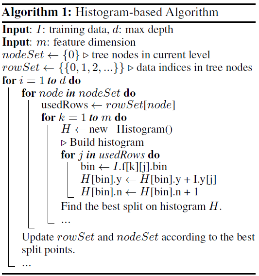
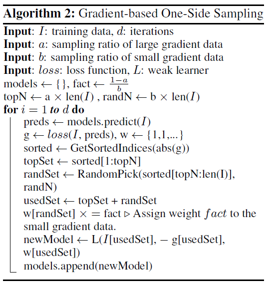
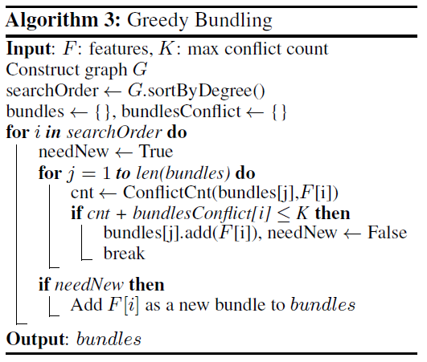
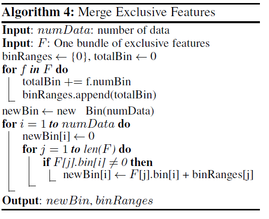

# LightGBM算法

基于梯度提升方法的集成决策树模型在机器学习中应用十分广泛。梯度提升方法在构建决策树时，需要遍历所有特征的所有取值，查找最优切分点。但是这种基于pre-sorted的方法十分耗时，在处理高维的大数据集时十分困难。LightGBM算法在查找特征的最优切分点时，没有使用基于pre-order的方法，而是使用了基于histogram的方法，大大加快运行速度，降低了内存消耗。

总的来说。LightGBM相当于XGBoost+Histogram+GOSS+EFB

若将lightgbm与XGBoost相比，lightgbm算法的改进之处包括：

- 采用基于直方图（histogram）的决策树算法。XGBoost使用基于pre-sorted方法查找最有特征的最优切分点，但面对高维大数据的处理速度较慢（相比基于直方图的方法）。
- 面对大量数据，设计了GOSS（基于梯度的one-side）采样方法提高训练速度。机器学习算法面对大数据量时候都会使用采样的方式（根据样本权值）来提高训练速度。
- 使用EFB（互斥特征捆绑）提高基于直方图的算法对稀疏数据的处理能力。基于直方图的方法在处理稀疏数据时效率较低，因此lightgbm设计了EFB方法处理稀疏数据。

## 1.基于直方图的方法

### 1.1直方图算法的思想

直方图算法的基本思想是将连续的特征离散化为 k 个离散特征，同时构造一个宽度为 k 的直方图用于统计信息（含有 k 个 bin）。利用直方图算法我们无需遍历数据，只需要遍历 k 个 bin 即可找到最佳分裂点。

我们知道特征离散化的具有很多优点，如存储方便、运算更快、鲁棒性强、模型更加稳定等等。对于直方图算法来说最直接的有以下两个优点（以 k=256 为例）：

- **内存占用更小：**XGBoost 需要用 32 位的浮点数去存储特征值，并用 32 位的整形去存储索引，而 LightGBM 只需要用 8 位去存储直方图，相当于减少了 1/8；在每次查找特征的最优切分点时，直方图算法不需要将所有数据读取进内存再排序，只需要存储直方图。

- **时间复杂度更小：**计算每个特征分裂增益时，XGBoost 需要遍历一次所有数据找到最佳分裂点，而 LightGBM 只需要遍历一次 k个bin的直方图，因此时间复杂度从 $O(\#data*\#feature)$降低到 $O(k*\#feature)$。在LightGBM中，$\#data >> k$，所以时间复杂度降低十分明显。

  

直方图算法的流程如下：

### 1.2 直方图算法的加速

在构建叶节点的直方图时，我们还可以通过父节点的直方图与相邻叶节点的直方图相减的方式构建，从而减少了一半的计算量。在实际操作过程中，我们还可以先计算直方图小的叶子节点，然后利用直方图作差来获得直方图大的叶子节点。

### 1.3 稀疏数据的处理

XGBoost 在进行预排序时只考虑非零值进行加速，而 LightGBM 也采用类似策略：只用非零特征构建直方图。

## 2.GOSS采样方法

GBDT 算法的梯度大小可以反应样本的权重，梯度越小说明模型拟合的越好，单边梯度抽样算法（Gradient-based One-Side Sampling, GOSS）利用这一信息对样本进行抽样，减少了大量梯度小的样本，在接下来的计算锅中只需关注梯度高的样本，极大的减少了计算量。

GOSS 算法保留了梯度大的样本，并对梯度小的样本进行随机抽样，为了不改变样本的数据分布，在计算增益时为梯度小的样本引入一个常数进行平衡。具体算法如下所示：

我们可以看到 GOSS 事先基于梯度的绝对值对样本进行排序（**无需保存排序后结果**），然后拿到前 a% 的梯度大的样本，和总体样本的 b%，在计算增益时，通过乘上$\frac{1-a}{b}$ 来放大梯度小的样本的权重。**一方面算法将更多的注意力放在训练不足的样本上，另一方面通过乘上权重来防止采样对原始数据分布造成太大的影响。**

## 3. EFB互斥特征捆绑

高维特征往往是稀疏的，而且特征间可能是相互排斥的（如两个特征不同时取非零值），如果两个特征并不完全互斥（如只有一部分情况下是不同时取非零值），可以用互斥率表示互斥程度。互斥特征捆绑算法（Exclusive Feature Bundling, EFB）指出如果将一些特征进行融合绑定，则可以降低特征数量。

### 3.1 查找可以绑定的特征

EFB 算法利用特征和特征间的关系构造一个加权无向图，并将其转换为图着色算法。我们知道图着色是个 NP-Hard 问题，故采用贪婪算法得到近似解，具体步骤如下：

1. 构造一个加权无向图，顶点是特征，边是两个特征间互斥程度；
2. 根据节点的度进行降序排序，度越大，与其他特征的冲突越大；
3. 遍历每个特征，将它分配给现有特征包，或者新建一个特征包，使得总体冲突最小。

算法允许两两特征并不完全互斥来增加特征捆绑的数量，通过设置最大互斥率$\gamma$来平衡算法的精度和效率。EFB 算法的伪代码如下所示：

我们看到时间复杂度为$O(\#feature^2)$ ，在特征不多的情况下可以应付，但如果特征维度达到百万级别，计算量则会非常大，为了改善效率，LightGBM提出了一个更快的解决方案：将 EFB 算法中通过构建图，根据节点度来排序的策略改成了根据非零值的技术排序，因为非零值越多，互斥的概率会越大。

### 3.2 特征值合并

论文给出特征合并算法，其关键在于原始特征能从合并后的捆绑特征中分离出来。假设 一个捆绑（Bundle） 中有两个特征值，A 取值范围为 [0, 10）、B 取值为 [0, 20），为了保证特征 A、B 的互斥性，我们可以给特征 B 添加一个偏移量10，将其取值范围转换为 [10, 30）。由于有偏移量的原因，特征A、B合并和不会产生冲突，且合并后的捆绑特征的取值范围为 [0, 30]，这样便实现了特征合并。具体算法如下所示：

## 4. 参数注释

### 4.1 核心参数

- `config` [🔗︎](https://lightgbm.readthedocs.io/en/latest/Parameters.html#config), default = `""`,config文件的路径
- `task` [🔗︎](https://lightgbm.readthedocs.io/en/latest/Parameters.html#task), default = `train`,可设置为 `train`, `predict`,`convert_model`, `refit`,代表数据的用途
  - `train`, 用于训练
  - `predict`,用于预测/测试
  - `convert_model`, 将模型转换为if-else 格式 [Convert Parameters](https://lightgbm.readthedocs.io/en/latest/Parameters.html#convert-parameters)
  - `refit`, 类似于迁移学习
- `objective` [🔗︎](https://lightgbm.readthedocs.io/en/latest/Parameters.html#objective), default = `regression`,可设置为: `regression`, `regression_l1`, `huber`, `fair`, `poisson`, `quantile`, `mape`, `gamma`, `tweedie`, `binary`, `multiclass`, `multiclassova`, `cross_entropy`, `cross_entropy_lambda`, `lambdarank`, `rank_xendcg`, 代表目标函数的形式，针对不同的任务，可选择不同的目标函数
  - regression任务
    - `regression`,二范数损失函数, 也被称为`regression_l2`, `l2`, `mean_squared_error`, `mse`, `l2_root`, `root_mean_squared_error`, `rmse`
    - `regression_l1`, 一范数损失, aliases: `l1`, `mean_absolute_error`, `mae`
    - `huber`, [Huber loss](https://en.wikipedia.org/wiki/Huber_loss)
    - `fair`, [Fair loss](https://www.kaggle.com/c/allstate-claims-severity/discussion/24520)
    - `poisson`, [Poisson regression](https://en.wikipedia.org/wiki/Poisson_regression)
    - `quantile`, [Quantile regression](https://en.wikipedia.org/wiki/Quantile_regression)
    - `mape`, [MAPE loss](https://en.wikipedia.org/wiki/Mean_absolute_percentage_error), aliases: `mean_absolute_percentage_error`
    - `gamma`, Gamma regression with log-link. It might be useful, e.g., for modeling insurance claims severity, or for any target that might be [gamma-distributed](https://en.wikipedia.org/wiki/Gamma_distribution#Occurrence_and_applications)
    - `tweedie`, Tweedie regression with log-link. It might be useful, e.g., for modeling total loss in insurance, or for any target that might be [tweedie-distributed](https://en.wikipedia.org/wiki/Tweedie_distribution#Occurrence_and_applications)
  - binary classification任务
    - `binary`, 单类别交叉熵 (logistic regression). 需要确保label的取值范围在 {0, 1}; 
  - multi-class classification任务
    - `multiclass`, [softmax](https://en.wikipedia.org/wiki/Softmax_function) 目标函数
    - `multiclassova`, [One-vs-All](https://en.wikipedia.org/wiki/Multiclass_classification#One-vs.-rest) binary objective function,
    - `num_class` should be set as well
  - cross-entropy application
    - `cross_entropy`, objective function for cross-entropy (with optional linear weights), aliases: `xentropy`
    - `cross_entropy_lambda`, alternative parameterization of cross-entropy, aliases: `xentlambda`
    - label is anything in interval [0, 1]
  - ranking任务
    - `lambdarank`, [lambdarank](https://papers.nips.cc/paper/2971-learning-to-rank-with-nonsmooth-cost-functions.pdf) objective. [label_gain](https://lightgbm.readthedocs.io/en/latest/Parameters.html#label_gain) can be used to set the gain (weight) of `int` label and all values in `label` must be smaller than number of elements in `label_gain`
    - `rank_xendcg`, [XE_NDCG_MART](https://arxiv.org/abs/1911.09798) ranking objective function, aliases: `xendcg`, `xe_ndcg`, `xe_ndcg_mart`, `xendcg_mart`
    - `rank_xendcg` is faster than and achieves the similar performance as `lambdarank`
    - label should be `int` type, and larger number represents the higher relevance (e.g. 0:bad, 1:fair, 2:good, 3:perfect)
- `boosting` [🔗︎](https://lightgbm.readthedocs.io/en/latest/Parameters.html#boosting), default = `gbdt`, type = enum, options: `gbdt`, `rf`, `dart`, `goss`, aliases: `boosting_type`, `boost`
  - `gbdt`, traditional Gradient Boosting Decision Tree, aliases: `gbrt`
  - `rf`, Random Forest, aliases: `random_forest`
  - `dart`, [Dropouts meet Multiple Additive Regression Trees](https://arxiv.org/abs/1505.01866)
  - `goss`, Gradient-based One-Side Sampling
    - **Note**: internally, LightGBM uses `gbdt` mode for the first `1 / learning_rate` iterations
- `linear_tree` [🔗︎](https://lightgbm.readthedocs.io/en/latest/Parameters.html#linear_tree), default = `false`, type = bool
  - fit piecewise linear gradient boosting tree
    - tree splits are chosen in the usual way, but the model at each leaf is linear instead of constant
    - the linear model at each leaf includes all the numerical features in that leaf’s branch
    - categorical features are used for splits as normal but are not used in the linear models
    - missing values should not be encoded as `0`. Use `np.nan` for Python, `NA` for the CLI, and `NA`, `NA_real_`, or `NA_integer_` for R
    - it is recommended to rescale data before training so that features have similar mean and standard deviation
    - **Note**: only works with CPU and `serial` tree learner
    - **Note**: `regression_l1` objective is not supported with linear tree boosting
    - **Note**: setting `linear_tree=true` significantly increases the memory use of LightGBM
- `data` [🔗︎](https://lightgbm.readthedocs.io/en/latest/Parameters.html#data), default = `""`, type = string, aliases: `train`, `train_data`, `train_data_file`, `data_filename`
  - path of training data, LightGBM will train from this data
  - **Note**: can be used only in CLI version
- `valid` [🔗︎](https://lightgbm.readthedocs.io/en/latest/Parameters.html#valid), default = `""`, type = string, aliases: `test`, `valid_data`, `valid_data_file`, `test_data`, `test_data_file`, `valid_filenames`
  - path(s) of validation/test data, LightGBM will output metrics for these data
  - support multiple validation data, separated by `,`
  - **Note**: can be used only in CLI version
- `num_iterations` [🔗︎](https://lightgbm.readthedocs.io/en/latest/Parameters.html#num_iterations), default = `100`, type = int, aliases: `num_iteration`, `n_iter`, `num_tree`, `num_trees`, `num_round`, `num_rounds`, `num_boost_round`, `n_estimators`, constraints: `num_iterations >= 0`
  - number of boosting iterations
  - **Note**: internally, LightGBM constructs `num_class * num_iterations` trees for multi-class classification problems
- `learning_rate` [🔗︎](https://lightgbm.readthedocs.io/en/latest/Parameters.html#learning_rate), default = `0.1`, type = double, aliases: `shrinkage_rate`, `eta`, constraints: `learning_rate > 0.0`
  - shrinkage rate
  - in `dart`, it also affects on normalization weights of dropped trees
- `num_leaves` [🔗︎](https://lightgbm.readthedocs.io/en/latest/Parameters.html#num_leaves), default = `31`, type = int, aliases: `num_leaf`, `max_leaves`, `max_leaf`, constraints: `1 < num_leaves <= 131072`
  - max number of leaves in one tree
- `tree_learner` [🔗︎](https://lightgbm.readthedocs.io/en/latest/Parameters.html#tree_learner), default = `serial`, type = enum, options: `serial`, `feature`, `data`, `voting`, aliases: `tree`, `tree_type`, `tree_learner_type`
  - `serial`, single machine tree learner
  - `feature`, feature parallel tree learner, aliases: `feature_parallel`
  - `data`, data parallel tree learner, aliases: `data_parallel`
  - `voting`, voting parallel tree learner, aliases: `voting_parallel`
  - refer to [Parallel Learning Guide](https://lightgbm.readthedocs.io/en/latest/Parallel-Learning-Guide.html) to get more details
- `num_threads` [🔗︎](https://lightgbm.readthedocs.io/en/latest/Parameters.html#num_threads), default = `0`, type = int, aliases: `num_thread`, `nthread`, `nthreads`, `n_jobs`
  - number of threads for LightGBM
  - `0` means default number of threads in OpenMP
  - for the best speed, set this to the number of **real CPU cores**, not the number of threads (most CPUs use [hyper-threading](https://en.wikipedia.org/wiki/Hyper-threading) to generate 2 threads per CPU core)
  - do not set it too large if your dataset is small (for instance, do not use 64 threads for a dataset with 10,000 rows)
  - be aware a task manager or any similar CPU monitoring tool might report that cores not being fully utilized. **This is normal**
  - for parallel learning, do not use all CPU cores because this will cause poor performance for the network communication
  - **Note**: please **don’t** change this during training, especially when running multiple jobs simultaneously by external packages, otherwise it may cause undesirable errors
- `device_type` [🔗︎](https://lightgbm.readthedocs.io/en/latest/Parameters.html#device_type), default = `cpu`, type = enum, options: `cpu`, `gpu`, aliases: `device`
  - device for the tree learning, you can use GPU to achieve the faster learning
  - **Note**: it is recommended to use the smaller `max_bin` (e.g. 63) to get the better speed up
  - **Note**: for the faster speed, GPU uses 32-bit float point to sum up by default, so this may affect the accuracy for some tasks. You can set `gpu_use_dp=true` to enable 64-bit float point, but it will slow down the training
  - **Note**: refer to [Installation Guide](https://lightgbm.readthedocs.io/en/latest/Installation-Guide.html#build-gpu-version) to build LightGBM with GPU support
- `seed` [🔗︎](https://lightgbm.readthedocs.io/en/latest/Parameters.html#seed), default = `None`, type = int, aliases: `random_seed`, `random_state`
  - this seed is used to generate other seeds, e.g. `data_random_seed`, `feature_fraction_seed`, etc.
  - by default, this seed is unused in favor of default values of other seeds
  - this seed has lower priority in comparison with other seeds, which means that it will be overridden, if you set other seeds explicitly
- `deterministic` [🔗︎](https://lightgbm.readthedocs.io/en/latest/Parameters.html#deterministic), default = `false`, type = bool
  - used only with `cpu` device type
  - setting this to `true` should ensure the stable results when using the same data and the same parameters (and different `num_threads`)
  - when you use the different seeds, different LightGBM versions, the binaries compiled by different compilers, or in different systems, the results are expected to be different
  - you can [raise issues](https://github.com/microsoft/LightGBM/issues) in LightGBM GitHub repo when you meet the unstable results
  - **Note**: setting this to `true` may slow down the training

## Learning Control Parameters

- `force_col_wise` [🔗︎](https://lightgbm.readthedocs.io/en/latest/Parameters.html#force_col_wise), default = `false`, type = bool
  - used only with `cpu` device type
  - set this to `true` to force col-wise histogram building
  - enabling this is recommended when:
    - the number of columns is large, or the total number of bins is large
    - `num_threads` is large, e.g. `> 20`
    - you want to reduce memory cost
  - **Note**: when both `force_col_wise` and `force_row_wise` are `false`, LightGBM will firstly try them both, and then use the faster one. To remove the overhead of testing set the faster one to `true` manually
  - **Note**: this parameter cannot be used at the same time with `force_row_wise`, choose only one of them
- `force_row_wise` [🔗︎](https://lightgbm.readthedocs.io/en/latest/Parameters.html#force_row_wise), default = `false`, type = bool
  - used only with `cpu` device type
  - set this to `true` to force row-wise histogram building
  - enabling this is recommended when:
    - the number of data points is large, and the total number of bins is relatively small
    - `num_threads` is relatively small, e.g. `<= 16`
    - you want to use small `bagging_fraction` or `goss` boosting to speed up
  - **Note**: setting this to `true` will double the memory cost for Dataset object. If you have not enough memory, you can try setting `force_col_wise=true`
  - **Note**: when both `force_col_wise` and `force_row_wise` are `false`, LightGBM will firstly try them both, and then use the faster one. To remove the overhead of testing set the faster one to `true` manually
  - **Note**: this parameter cannot be used at the same time with `force_col_wise`, choose only one of them
- `histogram_pool_size` [🔗︎](https://lightgbm.readthedocs.io/en/latest/Parameters.html#histogram_pool_size), default = `-1.0`, type = double, aliases: `hist_pool_size`
  - max cache size in MB for historical histogram
  - `< 0` means no limit
- `max_depth` [🔗︎](https://lightgbm.readthedocs.io/en/latest/Parameters.html#max_depth), default = `-1`, type = int
  - limit the max depth for tree model. This is used to deal with over-fitting when `#data` is small. Tree still grows leaf-wise
  - `<= 0` means no limit
- `min_data_in_leaf` [🔗︎](https://lightgbm.readthedocs.io/en/latest/Parameters.html#min_data_in_leaf), default = `20`, type = int, aliases: `min_data_per_leaf`, `min_data`, `min_child_samples`, constraints: `min_data_in_leaf >= 0`
  - minimal number of data in one leaf. Can be used to deal with over-fitting
  - **Note**: this is an approximation based on the Hessian, so occasionally you may observe splits which produce leaf nodes that have less than this many observations
- `min_sum_hessian_in_leaf` [🔗︎](https://lightgbm.readthedocs.io/en/latest/Parameters.html#min_sum_hessian_in_leaf), default = `1e-3`, type = double, aliases: `min_sum_hessian_per_leaf`, `min_sum_hessian`, `min_hessian`, `min_child_weight`, constraints: `min_sum_hessian_in_leaf >= 0.0`
  - minimal sum hessian in one leaf. Like `min_data_in_leaf`, it can be used to deal with over-fitting
- `bagging_fraction` [🔗︎](https://lightgbm.readthedocs.io/en/latest/Parameters.html#bagging_fraction), default = `1.0`, type = double, aliases: `sub_row`, `subsample`, `bagging`, constraints: `0.0 < bagging_fraction <= 1.0`
  - like `feature_fraction`, but this will randomly select part of data without resampling
  - can be used to speed up training
  - can be used to deal with over-fitting
  - **Note**: to enable bagging, `bagging_freq` should be set to a non zero value as well
- `pos_bagging_fraction` [🔗︎](https://lightgbm.readthedocs.io/en/latest/Parameters.html#pos_bagging_fraction), default = `1.0`, type = double, aliases: `pos_sub_row`, `pos_subsample`, `pos_bagging`, constraints: `0.0 < pos_bagging_fraction <= 1.0`
  - used only in `binary` application
  - used for imbalanced binary classification problem, will randomly sample `#pos_samples * pos_bagging_fraction` positive samples in bagging
  - should be used together with `neg_bagging_fraction`
  - set this to `1.0` to disable
  - **Note**: to enable this, you need to set `bagging_freq` and `neg_bagging_fraction` as well
  - **Note**: if both `pos_bagging_fraction` and `neg_bagging_fraction` are set to `1.0`, balanced bagging is disabled
  - **Note**: if balanced bagging is enabled, `bagging_fraction` will be ignored
- `neg_bagging_fraction` [🔗︎](https://lightgbm.readthedocs.io/en/latest/Parameters.html#neg_bagging_fraction), default = `1.0`, type = double, aliases: `neg_sub_row`, `neg_subsample`, `neg_bagging`, constraints: `0.0 < neg_bagging_fraction <= 1.0`
  - used only in `binary` application
  - used for imbalanced binary classification problem, will randomly sample `#neg_samples * neg_bagging_fraction` negative samples in bagging
  - should be used together with `pos_bagging_fraction`
  - set this to `1.0` to disable
  - **Note**: to enable this, you need to set `bagging_freq` and `pos_bagging_fraction` as well
  - **Note**: if both `pos_bagging_fraction` and `neg_bagging_fraction` are set to `1.0`, balanced bagging is disabled
  - **Note**: if balanced bagging is enabled, `bagging_fraction` will be ignored
- `bagging_freq` [🔗︎](https://lightgbm.readthedocs.io/en/latest/Parameters.html#bagging_freq), default = `0`, type = int, aliases: `subsample_freq`
  - frequency for bagging
  - `0` means disable bagging; `k` means perform bagging at every `k` iteration. Every `k`-th iteration, LightGBM will randomly select `bagging_fraction * 100 %` of the data to use for the next `k` iterations
  - **Note**: to enable bagging, `bagging_fraction` should be set to value smaller than `1.0` as well
- `bagging_seed` [🔗︎](https://lightgbm.readthedocs.io/en/latest/Parameters.html#bagging_seed), default = `3`, type = int, aliases: `bagging_fraction_seed`
  - random seed for bagging
- `feature_fraction` [🔗︎](https://lightgbm.readthedocs.io/en/latest/Parameters.html#feature_fraction), default = `1.0`, type = double, aliases: `sub_feature`, `colsample_bytree`, constraints: `0.0 < feature_fraction <= 1.0`
  - LightGBM will randomly select a subset of features on each iteration (tree) if `feature_fraction` is smaller than `1.0`. For example, if you set it to `0.8`, LightGBM will select 80% of features before training each tree
  - can be used to speed up training
  - can be used to deal with over-fitting
- `feature_fraction_bynode` [🔗︎](https://lightgbm.readthedocs.io/en/latest/Parameters.html#feature_fraction_bynode), default = `1.0`, type = double, aliases: `sub_feature_bynode`, `colsample_bynode`, constraints: `0.0 < feature_fraction_bynode <= 1.0`
  - LightGBM will randomly select a subset of features on each tree node if `feature_fraction_bynode` is smaller than `1.0`. For example, if you set it to `0.8`, LightGBM will select 80% of features at each tree node
  - can be used to deal with over-fitting
  - **Note**: unlike `feature_fraction`, this cannot speed up training
  - **Note**: if both `feature_fraction` and `feature_fraction_bynode` are smaller than `1.0`, the final fraction of each node is `feature_fraction * feature_fraction_bynode`
- `feature_fraction_seed` [🔗︎](https://lightgbm.readthedocs.io/en/latest/Parameters.html#feature_fraction_seed), default = `2`, type = int
  - random seed for `feature_fraction`
- `extra_trees` [🔗︎](https://lightgbm.readthedocs.io/en/latest/Parameters.html#extra_trees), default = `false`, type = bool
  - use extremely randomized trees
  - if set to `true`, when evaluating node splits LightGBM will check only one randomly-chosen threshold for each feature
  - can be used to speed up training
  - can be used to deal with over-fitting
- `extra_seed` [🔗︎](https://lightgbm.readthedocs.io/en/latest/Parameters.html#extra_seed), default = `6`, type = int
  - random seed for selecting thresholds when `extra_trees` is true
- `early_stopping_round` [🔗︎](https://lightgbm.readthedocs.io/en/latest/Parameters.html#early_stopping_round), default = `0`, type = int, aliases: `early_stopping_rounds`, `early_stopping`, `n_iter_no_change`
  - will stop training if one metric of one validation data doesn’t improve in last `early_stopping_round` rounds
  - `<= 0` means disable
  - can be used to speed up training
- `first_metric_only` [🔗︎](https://lightgbm.readthedocs.io/en/latest/Parameters.html#first_metric_only), default = `false`, type = bool
  - LightGBM allows you to provide multiple evaluation metrics. Set this to `true`, if you want to use only the first metric for early stopping
- `max_delta_step` [🔗︎](https://lightgbm.readthedocs.io/en/latest/Parameters.html#max_delta_step), default = `0.0`, type = double, aliases: `max_tree_output`, `max_leaf_output`
  - used to limit the max output of tree leaves
  - `<= 0` means no constraint
  - the final max output of leaves is `learning_rate * max_delta_step`
- `lambda_l1` [🔗︎](https://lightgbm.readthedocs.io/en/latest/Parameters.html#lambda_l1), default = `0.0`, type = double, aliases: `reg_alpha`, constraints: `lambda_l1 >= 0.0`
  - L1 regularization
- `lambda_l2` [🔗︎](https://lightgbm.readthedocs.io/en/latest/Parameters.html#lambda_l2), default = `0.0`, type = double, aliases: `reg_lambda`, `lambda`, constraints: `lambda_l2 >= 0.0`
  - L2 regularization
- `linear_lambda` [🔗︎](https://lightgbm.readthedocs.io/en/latest/Parameters.html#linear_lambda), default = `0.0`, type = double, constraints: `linear_lambda >= 0.0`
  - linear tree regularization, corresponds to the parameter `lambda` in Eq. 3 of [Gradient Boosting with Piece-Wise Linear Regression Trees](https://arxiv.org/pdf/1802.05640.pdf)
- `min_gain_to_split` [🔗︎](https://lightgbm.readthedocs.io/en/latest/Parameters.html#min_gain_to_split), default = `0.0`, type = double, aliases: `min_split_gain`, constraints: `min_gain_to_split >= 0.0`
  - the minimal gain to perform split
  - can be used to speed up training
- `drop_rate` [🔗︎](https://lightgbm.readthedocs.io/en/latest/Parameters.html#drop_rate), default = `0.1`, type = double, aliases: `rate_drop`, constraints: `0.0 <= drop_rate <= 1.0`
  - used only in `dart`
  - dropout rate: a fraction of previous trees to drop during the dropout
- `max_drop` [🔗︎](https://lightgbm.readthedocs.io/en/latest/Parameters.html#max_drop), default = `50`, type = int
  - used only in `dart`
  - max number of dropped trees during one boosting iteration
  - `<=0` means no limit
- `skip_drop` [🔗︎](https://lightgbm.readthedocs.io/en/latest/Parameters.html#skip_drop), default = `0.5`, type = double, constraints: `0.0 <= skip_drop <= 1.0`
  - used only in `dart`
  - probability of skipping the dropout procedure during a boosting iteration
- `xgboost_dart_mode` [🔗︎](https://lightgbm.readthedocs.io/en/latest/Parameters.html#xgboost_dart_mode), default = `false`, type = bool
  - used only in `dart`
  - set this to `true`, if you want to use xgboost dart mode
- `uniform_drop` [🔗︎](https://lightgbm.readthedocs.io/en/latest/Parameters.html#uniform_drop), default = `false`, type = bool
  - used only in `dart`
  - set this to `true`, if you want to use uniform drop
- `drop_seed` [🔗︎](https://lightgbm.readthedocs.io/en/latest/Parameters.html#drop_seed), default = `4`, type = int
  - used only in `dart`
  - random seed to choose dropping models
- `top_rate` [🔗︎](https://lightgbm.readthedocs.io/en/latest/Parameters.html#top_rate), default = `0.2`, type = double, constraints: `0.0 <= top_rate <= 1.0`
  - used only in `goss`
  - the retain ratio of large gradient data
- `other_rate` [🔗︎](https://lightgbm.readthedocs.io/en/latest/Parameters.html#other_rate), default = `0.1`, type = double, constraints: `0.0 <= other_rate <= 1.0`
  - used only in `goss`
  - the retain ratio of small gradient data
- `min_data_per_group` [🔗︎](https://lightgbm.readthedocs.io/en/latest/Parameters.html#min_data_per_group), default = `100`, type = int, constraints: `min_data_per_group > 0`
  - minimal number of data per categorical group
- `max_cat_threshold` [🔗︎](https://lightgbm.readthedocs.io/en/latest/Parameters.html#max_cat_threshold), default = `32`, type = int, constraints: `max_cat_threshold > 0`
  - used for the categorical features
  - limit number of split points considered for categorical features. See [the documentation on how LightGBM finds optimal splits for categorical features](https://lightgbm.readthedocs.io/en/latest/Features.html#optimal-split-for-categorical-features) for more details
  - can be used to speed up training
- `cat_l2` [🔗︎](https://lightgbm.readthedocs.io/en/latest/Parameters.html#cat_l2), default = `10.0`, type = double, constraints: `cat_l2 >= 0.0`
  - used for the categorical features
  - L2 regularization in categorical split
- `cat_smooth` [🔗︎](https://lightgbm.readthedocs.io/en/latest/Parameters.html#cat_smooth), default = `10.0`, type = double, constraints: `cat_smooth >= 0.0`
  - used for the categorical features
  - this can reduce the effect of noises in categorical features, especially for categories with few data
- `max_cat_to_onehot` [🔗︎](https://lightgbm.readthedocs.io/en/latest/Parameters.html#max_cat_to_onehot), default = `4`, type = int, constraints: `max_cat_to_onehot > 0`
  - when number of categories of one feature smaller than or equal to `max_cat_to_onehot`, one-vs-other split algorithm will be used
- `top_k` [🔗︎](https://lightgbm.readthedocs.io/en/latest/Parameters.html#top_k), default = `20`, type = int, aliases: `topk`, constraints: `top_k > 0`
  - used only in `voting` tree learner, refer to [Voting parallel](https://lightgbm.readthedocs.io/en/latest/Parallel-Learning-Guide.html#choose-appropriate-parallel-algorithm)
  - set this to larger value for more accurate result, but it will slow down the training speed
- `monotone_constraints` [🔗︎](https://lightgbm.readthedocs.io/en/latest/Parameters.html#monotone_constraints), default = `None`, type = multi-int, aliases: `mc`, `monotone_constraint`
  - used for constraints of monotonic features
  - `1` means increasing, `-1` means decreasing, `0` means non-constraint
  - you need to specify all features in order. For example, `mc=-1,0,1` means decreasing for 1st feature, non-constraint for 2nd feature and increasing for the 3rd feature
- `monotone_constraints_method` [🔗︎](https://lightgbm.readthedocs.io/en/latest/Parameters.html#monotone_constraints_method), default = `basic`, type = enum, options: `basic`, `intermediate`, `advanced`, aliases: `monotone_constraining_method`, `mc_method`
  - used only if `monotone_constraints` is set
  - monotone constraints method
    - `basic`, the most basic monotone constraints method. It does not slow the library at all, but over-constrains the predictions
    - `intermediate`, a [more advanced method](https://hal.archives-ouvertes.fr/hal-02862802/document), which may slow the library very slightly. However, this method is much less constraining than the basic method and should significantly improve the results
    - `advanced`, an [even more advanced method](https://hal.archives-ouvertes.fr/hal-02862802/document), which may slow the library. However, this method is even less constraining than the intermediate method and should again significantly improve the results
- `monotone_penalty` [🔗︎](https://lightgbm.readthedocs.io/en/latest/Parameters.html#monotone_penalty), default = `0.0`, type = double, aliases: `monotone_splits_penalty`, `ms_penalty`, `mc_penalty`, constraints: `monotone_penalty >= 0.0`
  - used only if `monotone_constraints` is set
  - [monotone penalty](https://hal.archives-ouvertes.fr/hal-02862802/document): a penalization parameter X forbids any monotone splits on the first X (rounded down) level(s) of the tree. The penalty applied to monotone splits on a given depth is a continuous, increasing function the penalization parameter
  - if `0.0` (the default), no penalization is applied
- `feature_contri` [🔗︎](https://lightgbm.readthedocs.io/en/latest/Parameters.html#feature_contri), default = `None`, type = multi-double, aliases: `feature_contrib`, `fc`, `fp`, `feature_penalty`
  - used to control feature’s split gain, will use `gain[i] = max(0, feature_contri[i]) * gain[i]` to replace the split gain of i-th feature
  - you need to specify all features in order
- `forcedsplits_filename` [🔗︎](https://lightgbm.readthedocs.io/en/latest/Parameters.html#forcedsplits_filename), default = `""`, type = string, aliases: `fs`, `forced_splits_filename`, `forced_splits_file`, `forced_splits`
  - path to a `.json` file that specifies splits to force at the top of every decision tree before best-first learning commences
  - `.json` file can be arbitrarily nested, and each split contains `feature`, `threshold` fields, as well as `left` and `right` fields representing subsplits
  - categorical splits are forced in a one-hot fashion, with `left` representing the split containing the feature value and `right` representing other values
  - **Note**: the forced split logic will be ignored, if the split makes gain worse
  - see [this file](https://github.com/microsoft/LightGBM/tree/master/examples/binary_classification/forced_splits.json) as an example
- `refit_decay_rate` [🔗︎](https://lightgbm.readthedocs.io/en/latest/Parameters.html#refit_decay_rate), default = `0.9`, type = double, constraints: `0.0 <= refit_decay_rate <= 1.0`
  - decay rate of `refit` task, will use `leaf_output = refit_decay_rate * old_leaf_output + (1.0 - refit_decay_rate) * new_leaf_output` to refit trees
  - used only in `refit` task in CLI version or as argument in `refit` function in language-specific package
- `cegb_tradeoff` [🔗︎](https://lightgbm.readthedocs.io/en/latest/Parameters.html#cegb_tradeoff), default = `1.0`, type = double, constraints: `cegb_tradeoff >= 0.0`
  - cost-effective gradient boosting multiplier for all penalties
- `cegb_penalty_split` [🔗︎](https://lightgbm.readthedocs.io/en/latest/Parameters.html#cegb_penalty_split), default = `0.0`, type = double, constraints: `cegb_penalty_split >= 0.0`
  - cost-effective gradient-boosting penalty for splitting a node
- `cegb_penalty_feature_lazy` [🔗︎](https://lightgbm.readthedocs.io/en/latest/Parameters.html#cegb_penalty_feature_lazy), default = `0,0,...,0`, type = multi-double
  - cost-effective gradient boosting penalty for using a feature
  - applied per data point
- `cegb_penalty_feature_coupled` [🔗︎](https://lightgbm.readthedocs.io/en/latest/Parameters.html#cegb_penalty_feature_coupled), default = `0,0,...,0`, type = multi-double
  - cost-effective gradient boosting penalty for using a feature
  - applied once per forest
- `path_smooth` [🔗︎](https://lightgbm.readthedocs.io/en/latest/Parameters.html#path_smooth), default = `0`, type = double, constraints: `path_smooth >= 0.0`
  - controls smoothing applied to tree nodes
  - helps prevent overfitting on leaves with few samples
  - if set to zero, no smoothing is applied
  - if `path_smooth > 0` then `min_data_in_leaf` must be at least `2`
  - larger values give stronger regularization
    - the weight of each node is `(n / path_smooth) * w + w_p / (n / path_smooth + 1)`, where `n` is the number of samples in the node, `w` is the optimal node weight to minimise the loss (approximately `-sum_gradients / sum_hessians`), and `w_p` is the weight of the parent node
    - note that the parent output `w_p` itself has smoothing applied, unless it is the root node, so that the smoothing effect accumulates with the tree depth
- `interaction_constraints` [🔗︎](https://lightgbm.readthedocs.io/en/latest/Parameters.html#interaction_constraints), default = `""`, type = string
  - controls which features can appear in the same branch
  - by default interaction constraints are disabled, to enable them you can specify
    - for CLI, lists separated by commas, e.g. `[0,1,2],[2,3]`
    - for Python-package, list of lists, e.g. `[[0, 1, 2], [2, 3]]`
    - for R-package, list of character or numeric vectors, e.g. `list(c("var1", "var2", "var3"), c("var3", "var4"))` or `list(c(1L, 2L, 3L), c(3L, 4L))`. Numeric vectors should use 1-based indexing, where `1L` is the first feature, `2L` is the second feature, etc
  - any two features can only appear in the same branch only if there exists a constraint containing both features
- `verbosity` [🔗︎](https://lightgbm.readthedocs.io/en/latest/Parameters.html#verbosity), default = `1`, type = int, aliases: `verbose`
  - controls the level of LightGBM’s verbosity
  - `< 0`: Fatal, `= 0`: Error (Warning), `= 1`: Info, `> 1`: Debug
- `input_model` [🔗︎](https://lightgbm.readthedocs.io/en/latest/Parameters.html#input_model), default = `""`, type = string, aliases: `model_input`, `model_in`
  - filename of input model
  - for `prediction` task, this model will be applied to prediction data
  - for `train` task, training will be continued from this model
  - **Note**: can be used only in CLI version
- `output_model` [🔗︎](https://lightgbm.readthedocs.io/en/latest/Parameters.html#output_model), default = `LightGBM_model.txt`, type = string, aliases: `model_output`, `model_out`
  - filename of output model in training
  - **Note**: can be used only in CLI version
- `saved_feature_importance_type` [🔗︎](https://lightgbm.readthedocs.io/en/latest/Parameters.html#saved_feature_importance_type), default = `0`, type = int
  - the feature importance type in the saved model file
  - `0`: count-based feature importance (numbers of splits are counted); `1`: gain-based feature importance (values of gain are counted)
  - **Note**: can be used only in CLI version
- `snapshot_freq` [🔗︎](https://lightgbm.readthedocs.io/en/latest/Parameters.html#snapshot_freq), default = `-1`, type = int, aliases: `save_period`
  - frequency of saving model file snapshot
  - set this to positive value to enable this function. For example, the model file will be snapshotted at each iteration if `snapshot_freq=1`
  - **Note**: can be used only in CLI version

## IO Parameters

### Dataset Parameters

- `max_bin` [🔗︎](https://lightgbm.readthedocs.io/en/latest/Parameters.html#max_bin), default = `255`, type = int, constraints: `max_bin > 1`
  - max number of bins that feature values will be bucketed in
  - small number of bins may reduce training accuracy but may increase general power (deal with over-fitting)
  - LightGBM will auto compress memory according to `max_bin`. For example, LightGBM will use `uint8_t` for feature value if `max_bin=255`
- `max_bin_by_feature` [🔗︎](https://lightgbm.readthedocs.io/en/latest/Parameters.html#max_bin_by_feature), default = `None`, type = multi-int
  - max number of bins for each feature
  - if not specified, will use `max_bin` for all features
- `min_data_in_bin` [🔗︎](https://lightgbm.readthedocs.io/en/latest/Parameters.html#min_data_in_bin), default = `3`, type = int, constraints: `min_data_in_bin > 0`
  - minimal number of data inside one bin
  - use this to avoid one-data-one-bin (potential over-fitting)
- `bin_construct_sample_cnt` [🔗︎](https://lightgbm.readthedocs.io/en/latest/Parameters.html#bin_construct_sample_cnt), default = `200000`, type = int, aliases: `subsample_for_bin`, constraints: `bin_construct_sample_cnt > 0`
  - number of data that sampled to construct feature discrete bins
  - setting this to larger value will give better training result, but may increase data loading time
  - set this to larger value if data is very sparse
  - **Note**: don’t set this to small values, otherwise, you may encounter unexpected errors and poor accuracy
- `data_random_seed` [🔗︎](https://lightgbm.readthedocs.io/en/latest/Parameters.html#data_random_seed), default = `1`, type = int, aliases: `data_seed`
  - random seed for sampling data to construct histogram bins
- `is_enable_sparse` [🔗︎](https://lightgbm.readthedocs.io/en/latest/Parameters.html#is_enable_sparse), default = `true`, type = bool, aliases: `is_sparse`, `enable_sparse`, `sparse`
  - used to enable/disable sparse optimization
- `enable_bundle` [🔗︎](https://lightgbm.readthedocs.io/en/latest/Parameters.html#enable_bundle), default = `true`, type = bool, aliases: `is_enable_bundle`, `bundle`
  - set this to `false` to disable Exclusive Feature Bundling (EFB), which is described in [LightGBM: A Highly Efficient Gradient Boosting Decision Tree](https://papers.nips.cc/paper/6907-lightgbm-a-highly-efficient-gradient-boosting-decision-tree)
  - **Note**: disabling this may cause the slow training speed for sparse datasets
- `use_missing` [🔗︎](https://lightgbm.readthedocs.io/en/latest/Parameters.html#use_missing), default = `true`, type = bool
  - set this to `false` to disable the special handle of missing value
- `zero_as_missing` [🔗︎](https://lightgbm.readthedocs.io/en/latest/Parameters.html#zero_as_missing), default = `false`, type = bool
  - set this to `true` to treat all zero as missing values (including the unshown values in LibSVM / sparse matrices)
  - set this to `false` to use `na` for representing missing values
- `feature_pre_filter` [🔗︎](https://lightgbm.readthedocs.io/en/latest/Parameters.html#feature_pre_filter), default = `true`, type = bool
  - set this to `true` (the default) to tell LightGBM to ignore the features that are unsplittable based on `min_data_in_leaf`
  - as dataset object is initialized only once and cannot be changed after that, you may need to set this to `false` when searching parameters with `min_data_in_leaf`, otherwise features are filtered by `min_data_in_leaf` firstly if you don’t reconstruct dataset object
  - **Note**: setting this to `false` may slow down the training
- `pre_partition` [🔗︎](https://lightgbm.readthedocs.io/en/latest/Parameters.html#pre_partition), default = `false`, type = bool, aliases: `is_pre_partition`
  - used for parallel learning (excluding the `feature_parallel` mode)
  - `true` if training data are pre-partitioned, and different machines use different partitions
- `two_round` [🔗︎](https://lightgbm.readthedocs.io/en/latest/Parameters.html#two_round), default = `false`, type = bool, aliases: `two_round_loading`, `use_two_round_loading`
  - set this to `true` if data file is too big to fit in memory
  - by default, LightGBM will map data file to memory and load features from memory. This will provide faster data loading speed, but may cause run out of memory error when the data file is very big
  - **Note**: works only in case of loading data directly from file
- `header` [🔗︎](https://lightgbm.readthedocs.io/en/latest/Parameters.html#header), default = `false`, type = bool, aliases: `has_header`
  - set this to `true` if input data has header
  - **Note**: works only in case of loading data directly from file
- `label_column` [🔗︎](https://lightgbm.readthedocs.io/en/latest/Parameters.html#label_column), default = `""`, type = int or string, aliases: `label`
  - used to specify the label column
  - use number for index, e.g. `label=0` means column_0 is the label
  - add a prefix `name:` for column name, e.g. `label=name:is_click`
  - **Note**: works only in case of loading data directly from file
- `weight_column` [🔗︎](https://lightgbm.readthedocs.io/en/latest/Parameters.html#weight_column), default = `""`, type = int or string, aliases: `weight`
  - used to specify the weight column
  - use number for index, e.g. `weight=0` means column_0 is the weight
  - add a prefix `name:` for column name, e.g. `weight=name:weight`
  - **Note**: works only in case of loading data directly from file
  - **Note**: index starts from `0` and it doesn’t count the label column when passing type is `int`, e.g. when label is column_0, and weight is column_1, the correct parameter is `weight=0`
- `group_column` [🔗︎](https://lightgbm.readthedocs.io/en/latest/Parameters.html#group_column), default = `""`, type = int or string, aliases: `group`, `group_id`, `query_column`, `query`, `query_id`
  - used to specify the query/group id column
  - use number for index, e.g. `query=0` means column_0 is the query id
  - add a prefix `name:` for column name, e.g. `query=name:query_id`
  - **Note**: works only in case of loading data directly from file
  - **Note**: data should be grouped by query_id, for more information, see [Query Data](https://lightgbm.readthedocs.io/en/latest/Parameters.html#query-data)
  - **Note**: index starts from `0` and it doesn’t count the label column when passing type is `int`, e.g. when label is column_0 and query_id is column_1, the correct parameter is `query=0`
- `ignore_column` [🔗︎](https://lightgbm.readthedocs.io/en/latest/Parameters.html#ignore_column), default = `""`, type = multi-int or string, aliases: `ignore_feature`, `blacklist`
  - used to specify some ignoring columns in training
  - use number for index, e.g. `ignore_column=0,1,2` means column_0, column_1 and column_2 will be ignored
  - add a prefix `name:` for column name, e.g. `ignore_column=name:c1,c2,c3` means c1, c2 and c3 will be ignored
  - **Note**: works only in case of loading data directly from file
  - **Note**: index starts from `0` and it doesn’t count the label column when passing type is `int`
  - **Note**: despite the fact that specified columns will be completely ignored during the training, they still should have a valid format allowing LightGBM to load file successfully
- `categorical_feature` [🔗︎](https://lightgbm.readthedocs.io/en/latest/Parameters.html#categorical_feature), default = `""`, type = multi-int or string, aliases: `cat_feature`, `categorical_column`, `cat_column`
  - used to specify categorical features
  - use number for index, e.g. `categorical_feature=0,1,2` means column_0, column_1 and column_2 are categorical features
  - add a prefix `name:` for column name, e.g. `categorical_feature=name:c1,c2,c3` means c1, c2 and c3 are categorical features
  - **Note**: only supports categorical with `int` type (not applicable for data represented as pandas DataFrame in Python-package)
  - **Note**: index starts from `0` and it doesn’t count the label column when passing type is `int`
  - **Note**: all values should be less than `Int32.MaxValue` (2147483647)
  - **Note**: using large values could be memory consuming. Tree decision rule works best when categorical features are presented by consecutive integers starting from zero
  - **Note**: all negative values will be treated as **missing values**
  - **Note**: the output cannot be monotonically constrained with respect to a categorical feature
- `forcedbins_filename` [🔗︎](https://lightgbm.readthedocs.io/en/latest/Parameters.html#forcedbins_filename), default = `""`, type = string
  - path to a `.json` file that specifies bin upper bounds for some or all features
  - `.json` file should contain an array of objects, each containing the word `feature` (integer feature index) and `bin_upper_bound` (array of thresholds for binning)
  - see [this file](https://github.com/microsoft/LightGBM/tree/master/examples/regression/forced_bins.json) as an example
- `save_binary` [🔗︎](https://lightgbm.readthedocs.io/en/latest/Parameters.html#save_binary), default = `false`, type = bool, aliases: `is_save_binary`, `is_save_binary_file`
  - if `true`, LightGBM will save the dataset (including validation data) to a binary file. This speed ups the data loading for the next time
  - **Note**: `init_score` is not saved in binary file
  - **Note**: can be used only in CLI version; for language-specific packages you can use the correspondent function

### Predict Parameters

- `start_iteration_predict` [🔗︎](https://lightgbm.readthedocs.io/en/latest/Parameters.html#start_iteration_predict), default = `0`, type = int
  - used only in `prediction` task
  - used to specify from which iteration to start the prediction
  - `<= 0` means from the first iteration
- `num_iteration_predict` [🔗︎](https://lightgbm.readthedocs.io/en/latest/Parameters.html#num_iteration_predict), default = `-1`, type = int
  - used only in `prediction` task
  - used to specify how many trained iterations will be used in prediction
  - `<= 0` means no limit
- `predict_raw_score` [🔗︎](https://lightgbm.readthedocs.io/en/latest/Parameters.html#predict_raw_score), default = `false`, type = bool, aliases: `is_predict_raw_score`, `predict_rawscore`, `raw_score`
  - used only in `prediction` task
  - set this to `true` to predict only the raw scores
  - set this to `false` to predict transformed scores
- `predict_leaf_index` [🔗︎](https://lightgbm.readthedocs.io/en/latest/Parameters.html#predict_leaf_index), default = `false`, type = bool, aliases: `is_predict_leaf_index`, `leaf_index`
  - used only in `prediction` task
  - set this to `true` to predict with leaf index of all trees
- `predict_contrib` [🔗︎](https://lightgbm.readthedocs.io/en/latest/Parameters.html#predict_contrib), default = `false`, type = bool, aliases: `is_predict_contrib`, `contrib`
  - used only in `prediction` task
  - set this to `true` to estimate [SHAP values](https://arxiv.org/abs/1706.06060), which represent how each feature contributes to each prediction
  - produces `#features + 1` values where the last value is the expected value of the model output over the training data
  - **Note**: if you want to get more explanation for your model’s predictions using SHAP values like SHAP interaction values, you can install [shap package](https://github.com/slundberg/shap)
  - **Note**: unlike the shap package, with `predict_contrib` we return a matrix with an extra column, where the last column is the expected value
- `predict_disable_shape_check` [🔗︎](https://lightgbm.readthedocs.io/en/latest/Parameters.html#predict_disable_shape_check), default = `false`, type = bool
  - used only in `prediction` task
  - control whether or not LightGBM raises an error when you try to predict on data with a different number of features than the training data
  - if `false` (the default), a fatal error will be raised if the number of features in the dataset you predict on differs from the number seen during training
  - if `true`, LightGBM will attempt to predict on whatever data you provide. This is dangerous because you might get incorrect predictions, but you could use it in situations where it is difficult or expensive to generate some features and you are very confident that they were never chosen for splits in the model
  - **Note**: be very careful setting this parameter to `true`
- `pred_early_stop` [🔗︎](https://lightgbm.readthedocs.io/en/latest/Parameters.html#pred_early_stop), default = `false`, type = bool
  - used only in `prediction` task
  - if `true`, will use early-stopping to speed up the prediction. May affect the accuracy
- `pred_early_stop_freq` [🔗︎](https://lightgbm.readthedocs.io/en/latest/Parameters.html#pred_early_stop_freq), default = `10`, type = int
  - used only in `prediction` task
  - the frequency of checking early-stopping prediction
- `pred_early_stop_margin` [🔗︎](https://lightgbm.readthedocs.io/en/latest/Parameters.html#pred_early_stop_margin), default = `10.0`, type = double
  - used only in `prediction` task
  - the threshold of margin in early-stopping prediction
- `output_result` [🔗︎](https://lightgbm.readthedocs.io/en/latest/Parameters.html#output_result), default = `LightGBM_predict_result.txt`, type = string, aliases: `predict_result`, `prediction_result`, `predict_name`, `prediction_name`, `pred_name`, `name_pred`
  - used only in `prediction` task
  - filename of prediction result
  - **Note**: can be used only in CLI version

### Convert Parameters

- `convert_model_language` [🔗︎](https://lightgbm.readthedocs.io/en/latest/Parameters.html#convert_model_language), default = `""`, type = string
  - used only in `convert_model` task
  - only `cpp` is supported yet; for conversion model to other languages consider using [m2cgen](https://github.com/BayesWitnesses/m2cgen) utility
  - if `convert_model_language` is set and `task=train`, the model will be also converted
  - **Note**: can be used only in CLI version
- `convert_model` [🔗︎](https://lightgbm.readthedocs.io/en/latest/Parameters.html#convert_model), default = `gbdt_prediction.cpp`, type = string, aliases: `convert_model_file`
  - used only in `convert_model` task
  - output filename of converted model
  - **Note**: can be used only in CLI version

## Objective Parameters

- `objective_seed` [🔗︎](https://lightgbm.readthedocs.io/en/latest/Parameters.html#objective_seed), default = `5`, type = int
  - used only in `rank_xendcg` objective
  - random seed for objectives, if random process is needed
- `num_class` [🔗︎](https://lightgbm.readthedocs.io/en/latest/Parameters.html#num_class), default = `1`, type = int, aliases: `num_classes`, constraints: `num_class > 0`
  - used only in `multi-class` classification application
- `is_unbalance` [🔗︎](https://lightgbm.readthedocs.io/en/latest/Parameters.html#is_unbalance), default = `false`, type = bool, aliases: `unbalance`, `unbalanced_sets`
  - used only in `binary` and `multiclassova` applications
  - set this to `true` if training data are unbalanced
  - **Note**: while enabling this should increase the overall performance metric of your model, it will also result in poor estimates of the individual class probabilities
  - **Note**: this parameter cannot be used at the same time with `scale_pos_weight`, choose only **one** of them
- `scale_pos_weight` [🔗︎](https://lightgbm.readthedocs.io/en/latest/Parameters.html#scale_pos_weight), default = `1.0`, type = double, constraints: `scale_pos_weight > 0.0`
  - used only in `binary` and `multiclassova` applications
  - weight of labels with positive class
  - **Note**: while enabling this should increase the overall performance metric of your model, it will also result in poor estimates of the individual class probabilities
  - **Note**: this parameter cannot be used at the same time with `is_unbalance`, choose only **one** of them
- `sigmoid` [🔗︎](https://lightgbm.readthedocs.io/en/latest/Parameters.html#sigmoid), default = `1.0`, type = double, constraints: `sigmoid > 0.0`
  - used only in `binary` and `multiclassova` classification and in `lambdarank` applications
  - parameter for the sigmoid function
- `boost_from_average` [🔗︎](https://lightgbm.readthedocs.io/en/latest/Parameters.html#boost_from_average), default = `true`, type = bool
  - used only in `regression`, `binary`, `multiclassova` and `cross-entropy` applications
  - adjusts initial score to the mean of labels for faster convergence
- `reg_sqrt` [🔗︎](https://lightgbm.readthedocs.io/en/latest/Parameters.html#reg_sqrt), default = `false`, type = bool
  - used only in `regression` application
  - used to fit `sqrt(label)` instead of original values and prediction result will be also automatically converted to `prediction^2`
  - might be useful in case of large-range labels
- `alpha` [🔗︎](https://lightgbm.readthedocs.io/en/latest/Parameters.html#alpha), default = `0.9`, type = double, constraints: `alpha > 0.0`
  - used only in `huber` and `quantile` `regression` applications
  - parameter for [Huber loss](https://en.wikipedia.org/wiki/Huber_loss) and [Quantile regression](https://en.wikipedia.org/wiki/Quantile_regression)
- `fair_c` [🔗︎](https://lightgbm.readthedocs.io/en/latest/Parameters.html#fair_c), default = `1.0`, type = double, constraints: `fair_c > 0.0`
  - used only in `fair` `regression` application
  - parameter for [Fair loss](https://www.kaggle.com/c/allstate-claims-severity/discussion/24520)
- `poisson_max_delta_step` [🔗︎](https://lightgbm.readthedocs.io/en/latest/Parameters.html#poisson_max_delta_step), default = `0.7`, type = double, constraints: `poisson_max_delta_step > 0.0`
  - used only in `poisson` `regression` application
  - parameter for [Poisson regression](https://en.wikipedia.org/wiki/Poisson_regression) to safeguard optimization
- `tweedie_variance_power` [🔗︎](https://lightgbm.readthedocs.io/en/latest/Parameters.html#tweedie_variance_power), default = `1.5`, type = double, constraints: `1.0 <= tweedie_variance_power < 2.0`
  - used only in `tweedie` `regression` application
  - used to control the variance of the tweedie distribution
  - set this closer to `2` to shift towards a **Gamma** distribution
  - set this closer to `1` to shift towards a **Poisson** distribution
- `lambdarank_truncation_level` [🔗︎](https://lightgbm.readthedocs.io/en/latest/Parameters.html#lambdarank_truncation_level), default = `30`, type = int, constraints: `lambdarank_truncation_level > 0`
  - used only in `lambdarank` application
  - controls the number of top-results to focus on during training, refer to “truncation level” in the Sec. 3 of [LambdaMART paper](https://www.microsoft.com/en-us/research/wp-content/uploads/2016/02/MSR-TR-2010-82.pdf)
  - this parameter is closely related to the desirable cutoff `k` in the metric **NDCG@k** that we aim at optimizing the ranker for. The optimal setting for this parameter is likely to be slightly higher than `k` (e.g., `k + 3`) to include more pairs of documents to train on, but perhaps not too high to avoid deviating too much from the desired target metric **NDCG@k**
- `lambdarank_norm` [🔗︎](https://lightgbm.readthedocs.io/en/latest/Parameters.html#lambdarank_norm), default = `true`, type = bool
  - used only in `lambdarank` application
  - set this to `true` to normalize the lambdas for different queries, and improve the performance for unbalanced data
  - set this to `false` to enforce the original lambdarank algorithm
- `label_gain` [🔗︎](https://lightgbm.readthedocs.io/en/latest/Parameters.html#label_gain), default = `0,1,3,7,15,31,63,...,2^30-1`, type = multi-double
  - used only in `lambdarank` application
  - relevant gain for labels. For example, the gain of label `2` is `3` in case of default label gains
  - separate by `,`

## Metric Parameters

- `metric` [🔗︎](https://lightgbm.readthedocs.io/en/latest/Parameters.html#metric), default = `""`, type = multi-enum, aliases: `metrics`, `metric_types`
  - metric(s) to be evaluated on the evaluation set(s)
    - `""` (empty string or not specified) means that metric corresponding to specified `objective` will be used (this is possible only for pre-defined objective functions, otherwise no evaluation metric will be added)
    - `"None"` (string, **not** a `None` value) means that no metric will be registered, aliases: `na`, `null`, `custom`
    - `l1`, absolute loss, aliases: `mean_absolute_error`, `mae`, `regression_l1`
    - `l2`, square loss, aliases: `mean_squared_error`, `mse`, `regression_l2`, `regression`
    - `rmse`, root square loss, aliases: `root_mean_squared_error`, `l2_root`
    - `quantile`, [Quantile regression](https://en.wikipedia.org/wiki/Quantile_regression)
    - `mape`, [MAPE loss](https://en.wikipedia.org/wiki/Mean_absolute_percentage_error), aliases: `mean_absolute_percentage_error`
    - `huber`, [Huber loss](https://en.wikipedia.org/wiki/Huber_loss)
    - `fair`, [Fair loss](https://www.kaggle.com/c/allstate-claims-severity/discussion/24520)
    - `poisson`, negative log-likelihood for [Poisson regression](https://en.wikipedia.org/wiki/Poisson_regression)
    - `gamma`, negative log-likelihood for **Gamma** regression
    - `gamma_deviance`, residual deviance for **Gamma** regression
    - `tweedie`, negative log-likelihood for **Tweedie** regression
    - `ndcg`, [NDCG](https://en.wikipedia.org/wiki/Discounted_cumulative_gain#Normalized_DCG), aliases: `lambdarank`, `rank_xendcg`, `xendcg`, `xe_ndcg`, `xe_ndcg_mart`, `xendcg_mart`
    - `map`, [MAP](https://makarandtapaswi.wordpress.com/2012/07/02/intuition-behind-average-precision-and-map/), aliases: `mean_average_precision`
    - `auc`, [AUC](https://en.wikipedia.org/wiki/Receiver_operating_characteristic#Area_under_the_curve)
    - `average_precision`, [average precision score](https://scikit-learn.org/stable/modules/generated/sklearn.metrics.average_precision_score.html)
    - `binary_logloss`, [log loss](https://en.wikipedia.org/wiki/Cross_entropy), aliases: `binary`
    - `binary_error`, for one sample: `0` for correct classification, `1` for error classification
    - `auc_mu`, [AUC-mu](http://proceedings.mlr.press/v97/kleiman19a/kleiman19a.pdf)
    - `multi_logloss`, log loss for multi-class classification, aliases: `multiclass`, `softmax`, `multiclassova`, `multiclass_ova`, `ova`, `ovr`
    - `multi_error`, error rate for multi-class classification
    - `cross_entropy`, cross-entropy (with optional linear weights), aliases: `xentropy`
    - `cross_entropy_lambda`, “intensity-weighted” cross-entropy, aliases: `xentlambda`
    - `kullback_leibler`, [Kullback-Leibler divergence](https://en.wikipedia.org/wiki/Kullback–Leibler_divergence), aliases: `kldiv`
  - support multiple metrics, separated by `,`
- `metric_freq` [🔗︎](https://lightgbm.readthedocs.io/en/latest/Parameters.html#metric_freq), default = `1`, type = int, aliases: `output_freq`, constraints: `metric_freq > 0`
  - frequency for metric output
  - **Note**: can be used only in CLI version
- `is_provide_training_metric` [🔗︎](https://lightgbm.readthedocs.io/en/latest/Parameters.html#is_provide_training_metric), default = `false`, type = bool, aliases: `training_metric`, `is_training_metric`, `train_metric`
  - set this to `true` to output metric result over training dataset
  - **Note**: can be used only in CLI version
- `eval_at` [🔗︎](https://lightgbm.readthedocs.io/en/latest/Parameters.html#eval_at), default = `1,2,3,4,5`, type = multi-int, aliases: `ndcg_eval_at`, `ndcg_at`, `map_eval_at`, `map_at`
  - used only with `ndcg` and `map` metrics
  - [NDCG](https://en.wikipedia.org/wiki/Discounted_cumulative_gain#Normalized_DCG) and [MAP](https://makarandtapaswi.wordpress.com/2012/07/02/intuition-behind-average-precision-and-map/) evaluation positions, separated by `,`
- `multi_error_top_k` [🔗︎](https://lightgbm.readthedocs.io/en/latest/Parameters.html#multi_error_top_k), default = `1`, type = int, constraints: `multi_error_top_k > 0`
  - used only with `multi_error` metric
  - threshold for top-k multi-error metric
  - the error on each sample is `0` if the true class is among the top `multi_error_top_k` predictions, and `1` otherwise
    - more precisely, the error on a sample is `0` if there are at least `num_classes - multi_error_top_k` predictions strictly less than the prediction on the true class
  - when `multi_error_top_k=1` this is equivalent to the usual multi-error metric
- `auc_mu_weights` [🔗︎](https://lightgbm.readthedocs.io/en/latest/Parameters.html#auc_mu_weights), default = `None`, type = multi-double
  - used only with `auc_mu` metric
  - list representing flattened matrix (in row-major order) giving loss weights for classification errors
  - list should have `n * n` elements, where `n` is the number of classes
  - the matrix co-ordinate `[i, j]` should correspond to the `i * n + j`-th element of the list
  - if not specified, will use equal weights for all classes

## Network Parameters

- `num_machines` [🔗︎](https://lightgbm.readthedocs.io/en/latest/Parameters.html#num_machines), default = `1`, type = int, aliases: `num_machine`, constraints: `num_machines > 0`
  - the number of machines for parallel learning application
  - this parameter is needed to be set in both **socket** and **mpi** versions
- `local_listen_port` [🔗︎](https://lightgbm.readthedocs.io/en/latest/Parameters.html#local_listen_port), default = `12400`, type = int, aliases: `local_port`, `port`, constraints: `local_listen_port > 0`
  - TCP listen port for local machines
  - **Note**: don’t forget to allow this port in firewall settings before training
- `time_out` [🔗︎](https://lightgbm.readthedocs.io/en/latest/Parameters.html#time_out), default = `120`, type = int, constraints: `time_out > 0`
  - socket time-out in minutes
- `machine_list_filename` [🔗︎](https://lightgbm.readthedocs.io/en/latest/Parameters.html#machine_list_filename), default = `""`, type = string, aliases: `machine_list_file`, `machine_list`, `mlist`
  - path of file that lists machines for this parallel learning application
  - each line contains one IP and one port for one machine. The format is `ip port` (space as a separator)
  - **Note**: can be used only in CLI version
- `machines` [🔗︎](https://lightgbm.readthedocs.io/en/latest/Parameters.html#machines), default = `""`, type = string, aliases: `workers`, `nodes`
  - list of machines in the following format: `ip1:port1,ip2:port2`

## GPU Parameters

- `gpu_platform_id` [🔗︎](https://lightgbm.readthedocs.io/en/latest/Parameters.html#gpu_platform_id), default = `-1`, type = int
  - OpenCL platform ID. Usually each GPU vendor exposes one OpenCL platform
  - `-1` means the system-wide default platform
  - **Note**: refer to [GPU Targets](https://lightgbm.readthedocs.io/en/latest/GPU-Targets.html#query-opencl-devices-in-your-system) for more details
- `gpu_device_id` [🔗︎](https://lightgbm.readthedocs.io/en/latest/Parameters.html#gpu_device_id), default = `-1`, type = int
  - OpenCL device ID in the specified platform. Each GPU in the selected platform has a unique device ID
  - `-1` means the default device in the selected platform
  - **Note**: refer to [GPU Targets](https://lightgbm.readthedocs.io/en/latest/GPU-Targets.html#query-opencl-devices-in-your-system) for more details
- `gpu_use_dp` [🔗︎](https://lightgbm.readthedocs.io/en/latest/Parameters.html#gpu_use_dp), default = `false`, type = bool
  - set this to `true` to use double precision math on GPU (by default single precision is used in OpenCL implementation and double precision is used in CUDA implementation)
- `num_gpu` [🔗︎](https://lightgbm.readthedocs.io/en/latest/Parameters.html#num_gpu), default = `1`, type = int, constraints: `num_gpu > 0`
  - number of GPUs
  - **Note**: can be used only in CUDA implementation

##  参考文献

手册：https://lightgbm.readthedocs.io/en/latest/

1. https://blog.csdn.net/qq_24519677/article/details/82811215
2. https://blog.csdn.net/maqunfi/article/details/82219999
3. https://zhuanlan.zhihu.com/p/87885678
4. https://blog.csdn.net/anshuai_aw1/article/details/83040541

