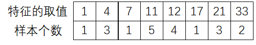

# XGBoost算法

XGBoost（eXterme Gradient Boosting）是基于决策树的集成学习方法。XGBoost以梯度提升算法为框架，利用加法模型和前向分布算法实现学习的优化过程，相比传统的梯度提升算法，区别在于：

- 修改了损失函数的正则项。XGBoost的损失函数正则项包含$l1$正则项（叶结点个数）和$l2$正则项（叶结点权重的平方和）
- 优化方法添加了二阶泰勒展开项。传统梯度提升使用损失函数的一阶导数学习，XGBoost则使用了损失函数的一阶、二阶导数学习
- 缺失值处理方法。XGBoost针对数据的缺失项进行处理，模型将自动选择子树结点的最优方向。
- 防止过拟合。XGBoost支持行列采样方式防止过拟合，其中列采样方式的效果更明显
- 卓越的工程实现。XGBoost工具包完全开源，且考虑了并行计算，分布式计算等问题，运行效率高

在2015年的kaggle平台竞赛中，XGBoost被广泛使用，足以证明其优秀。

## 1.基学习器：CART树

XGBoost使用CART树（分类与回归树）作为基学习器。与传统CART树不同（存疑？），这里的CART树每个叶结点具有一个权重作为叶结点的预测值（得分）。如图：

每颗CART树可表示为：
$$
f(x)=w_{q(x)}
$$
其中$q$表示树的结构，$q(x)$将输入映射到该树的某个叶结点，代表叶结点的index，$w_{q(x)}$表示以$q(x)$为index的叶结点权值

## 2.梯度提升方法

XGBoost算法的损失函数定义如下：
$$
L(\phi)=\sum_il(\hat{y_i},y_i)+\sum_k\Omega(f_k)
$$
$i$是实例（一个实例就是一条训练数据）循环index，$k$是XGBoost内包含的基学习器循环index

上式第一项度量了预测试与真实值之间的损失函数，第二项表示对模型复杂度的惩罚项，具体形式如下：
$$
\Omega(f)=\Upsilon T+\frac{1}{2}\lambda||w||^2
$$
$\Upsilon$，$\lambda$表示惩罚系数，$T$表示给定树的叶结点数量，$||w||^2$表示每颗树叶结点上的输出分数的平方（相当于l2正则）

为了求解决策树的参数（叶结点权值），需要最小化模型损失函数，这里使用梯度提升方法的加法模型思想与前向分布算法求解，对于实例$i$在$t$时刻的集成模型的预测值$\hat{y_i^{(t)}}$可以表示为前一时刻的预测值与当前决策树的结果之和，因此$t$时刻的损失函数可表示为：
$$
L^{t}=\sum_{i=1}^nl(y_i,\hat{y_i}^{(t-1)}+f_t(x_i))+\Omega(f_t)
$$
传统GDBT中使用负的一阶导数作为残差近似求解，而XGBoost中提出使用二阶泰勒展开近似求解损失函数：
$$
L^{(t)} \simeq \sum_{i=1}^n[l(y_i,\hat{y_i}^{(t-1)})+g_if_t(x_i)+\frac{1}{2}h_if_t^2(x_i)]+\Omega(f_t)+constant
$$
其中$g_i=\partial_{\hat{y}^{t-1}}l(y_i,\hat{y}^{(t-1)})$是一阶泰勒展开，$h_i=\partial^2_{\hat{y}^{(t-1)}}l(y_i,\hat{y}^{(t-1)})$是二阶泰勒展开。对于时刻$t$，$l(y_i,\hat{y_i}^{(t-1)})$与当前决策树的参数无关，所以是常数。损失函数可简化为：
$$
L^{(t)}=\sum_{i=1}^n[g_if_t(x_i)+\frac{1}{2}h_if_t^2(x_i)]+\Omega(f_t)
$$
考虑决策树$f_t(x_i)$的预测值就是叶结点的权值，以及$f(x)=w_{q(x)}$, 则可以将权值带入替换$f_t(x_i)$，同时将正则项带入可得到(已化简)：
$$
L^{(t)}=\sum_{j=1}^T[(\sum_{i \in I_j}g_i)w_j+\frac{1}{2}(\sum_{i \in I_j}h_i+\lambda)w_j^2]+\Upsilon T
$$
其中$I_j$表示叶结点j的实例集合，即属于叶结点j的训练数据条目集合。

对式（7）求权值$w$的一阶导数，并令其为0，可得：
$$
(\sum_{i \in I_j}g_i)+(\sum_{i \in I_j}h_i+\lambda)w_j=0
$$
解得：
$$
w^*_j=-\frac{\sum_{i \in I_j}g_i}{\sum_{i \in I_j}h_i+\lambda}
$$
将该值带入式（7），可得到：
$$
L^{(t)}=-\frac{1}{2}\sum_{j=1}^T\frac{\left(\sum_{i \in I_j}g_i\right)^2}{\sum_{i \in I_j}h_i+\lambda}+\Upsilon T
$$
式（10）是计算一颗决策树好坏的依据（类似于原始CART树使用的Gini指数），因为计算简单，便于后续的剪枝等操作，如下图所示，通过数据的一阶导数，二阶导数就可以计算一颗树的得分。

## 3.树的生成方法

### 3.1 结点切分的依据

CART树在生成过程中需要遍历每个特征的每个切分点，计算Gini指数，并选择最优特征的最优切分点将数据分为2部分。XGBoost的CART树没有采样Gini指数，而是依据式（10）计算如下增益：
$$
Gain=\frac{1}{2}[\frac{G^2_L}{H_L+\lambda}+\frac{G^2_R}{H_R+\lambda}-\frac{(G_L+G_R)^2}{H_L+H_R+\lambda}]-\Upsilon
$$
增益是由切分后的左半部分得分$\frac{G^2_L}{H_L+\lambda}$和右半部分得分$\frac{G^2_R}{H_R+\lambda}$与切分前得分$\frac{(G_L+G_R)^2}{H_L+H_R+\lambda}$的差，再减去切分后模型复杂度的增加量$\Upsilon$ 而得到的。

此外在增益计算的过程中已经考虑到了切分结点后模型复杂度的增加量，所以在树生成后无需再考虑剪枝问题。

### 3.2 查找最优切分点

XGBoost中最优特征以及最优切分点的搜索可采用2种方法：

- 精确的贪心算法
- 近似算法

#### 3.2.1 贪心算法

精确的贪心算法需要遍历每个特征的每个切分点，计算增益，最终选择增益最大的特征的切分点进行切分，流程如下：

#### 3.2.2 近似算法

贪心算法由于需要逐个遍历，且切分后还需要排序，所以会十分耗时。当数据量很大时，计算机甚至无法读取全部数据进入内存。XGBoost算法设计了一个近似算法，先选出一些候选切分结点，然后遍历这些候选结点，找出其中的最优切分点。因此近似算法的核心在于候选切分点的生成。

对于候选切分点的生成，直观的方法就是等宽度或等频率进行分桶，如图所示：

对于某个特征的分布情况：

**等宽度分桶方式：**

以宽度为3划分特征值，因此产生2个候选切分点：$(7+11)/2=9$和$(17+21)/2=19$

**等频率分桶方式：**

以出现频率0.25划分，产生3个候选切分点：：$(7+11)/2=9$，$(11+12)/2=11.5$，$(17+21)/2=19$

上述直观的候选切分点生成方法可以大幅减少计算复杂度，但却不能确保切分后的增益是近似最优的，因为这些生成方法不具备可解释性。XGBoost设计了一种加权分位数算法（Weight Quantile Sketch）来查找候选切分点。

考虑式（6）的损失函数，如果对其进行处理：
$$
\begin{align}
L^{(t)}&=\sum_{i=1}^n\left[g_if_t(x_i)+\frac{1}{2}h_if_t^2(x_i)\right]+\Omega(f_t)\\
&=\sum_{i=1}^n\left[\frac{1}{2}h_i \cdot \frac{2g_if_t(x_i)}{h_i}+\frac{1}{2}h_i\cdot f_t^2(x_i)\right]+\Omega(f_t)\\
&=\sum_{i=1}^n\frac{1}{2}h_i \cdot\left[\frac{2g_if_t(x_i)}{h_i}+ f_t^2(x_i)\right]+\Omega(f_t)\\
&=\sum_{i=1}^n\frac{1}{2}h_i \cdot\left[\left(f_t^2(x_i)+2\frac{g_i}{h_i}f_t(x_i)+\left(\frac{g_i}{h_i}\right)^2-\left(\frac{g_i}{h_i}\right)^2\right)\right]+\Omega(f_t)\\
&=\sum_{i=1}^n\frac{1}{2}h_i \cdot\left(f_t(x_i)-\left(-\frac{g_i}{h_i}\right)\right)^2+\Omega(f_t)+Constant
\end{align}
$$
式（16）的平方项可看作式平方损失，基学习器拟合的值是样本的残差$-\frac{g_i}{h_i}$，而括号前的$h_i$（就是前面提到的二阶梯度）可看作实例$i$对总的loss降低的贡献度。XGBoost选择数据的$h_i$作为生成候选切分点的依据。在进行候选点选取的时候，XGBoost算法让loss在左右子树上分布的尽量均匀，因为每个样本对降低loss的贡献$h_i$可能不一样，如果按样本数量均分（上文的等频率均分）会导致分开之后左子树和右子树loss分布不均匀，取到的分位点会有偏差。

XGBoost设计的分桶方法如下：

对于数据集第$k$个特征的取值和对应的二阶梯度值，定义一个排名函数$r_k(z)$:
$$
r_k(z)=\frac{1}{\sum_{(x,h) \in D_k}h}\sum_{(x,h)\in D_k,x<z}h
$$
其中$z$表示特征切分点的候选值，排名函数计算的是小于该候选值的特征的贡献度百分比。假设特征$k$的候选切分点集$\{s_{k1},s_{k2},...,s_{kl}\}$,且$s_{k1}=min_i x_{ik},\quad s_{kl}=max_ix_{ik}$。相邻两个候选切分点应当满足：
$$
|r_k(s_{kj})-r_k(s_{k(j+1)})|<\epsilon
$$
其中$\epsilon$控制了相邻点间的贡献度百分比差异，或者说是贡献度百分比的分位点（所以$\epsilon$的取值范围在0-1之间），而对应的总的候选切分点数为$\frac{1}{\epsilon}$个。近似算法的流程如下：

XGBoost提供了2种生成候选切分点的时刻：global和local

- global：在决策树创建的初始阶段，提出所有候选切分点，然后不断在其中查找最优
- local：在每次要切分特征的时候生成候选点，因此效率会低一点

论文中提供的实验结果显示，只要使用global模式时，生成更多的候选点（$\epsilon$小一点）就能和贪心算法与local模式取得相同的性能。

### 3.3停止分裂的条件

决策树不可能一直生长下去，XGBoost使用的限制条件是：                                     

- 特征切分带来的增益小于0
- 达到设定的最大深度时
- 当切分后生成的子树的叶子节点的权值$w$小于设定的阈值时（防止过拟合的一种手段，有效防止数分的太细）

​                                            

由此理论推导过程完全结束。简要推导过程如下：

                                                                                                                                                                                                                                                                                                                                                                                                                                                 

## 4.缺失(稀疏)数据的处理

实际工程中可能会出现数据某一特征的缺失情况，或者由于使用one-hot等编码导致的稀疏情况。XGBoost将数据稀疏和缺失情况统一考虑。

在树生长的过程中，为了寻找最优切分点，算法不会对该特征为missing的样本进行遍历统计，只对该列特征值为non-missing的样本上对应的特征值进行遍历，通过这个技巧来减少了为稀疏离散（缺失）特征寻找切分点的时间开销。

在逻辑实现上，为了保证完备性，会分别处理将missing该特征值的样本分配到左叶子结点和右叶子结点的两种情形，计算增益后选择增益大的方向进行分裂即可。缺失值实例会指定决策树分支的默认方向，这能大大提升算法的效率。如果在训练中没有缺失值而在预测中出现缺失，那么会自动将缺失值的划分方向放到右子树。

## 5. 工程创新性

### 5.1 列块并行学习

在树生成过程中，最耗时的一个步骤就是在每次寻找最佳分裂点时都需要对特征的值进行排序。而 XGBoost 在训练之前会根据特征对数据进行排序，然后保存到块结构中，并在每个块结构中都采用了稀疏矩阵存储格式（Compressed Sparse Columns Format，CSC）进行存储，后面的训练过程中会重复地使用块结构，可以大大减小计算量。

作者提出通过按特征进行分块并排序，在块里面保存排序后的特征值及对应样本的引用，以便于获取样本的一阶、二阶导数值。具体方式如图：

通过顺序访问排序后的块遍历样本特征的特征值，方便进行切分点的查找。此外分块存储后多个特征之间互不干涉，可以使用多线程同时对不同的特征进行切分点查找，即特征的并行化处理。在对节点进行分裂时需要选择增益最大的特征作为分裂，这时各个特征的增益计算可以同时进行，这也是 XGBoost 能够实现分布式或者多线程计算的原因。

### 5.2 缓存访问

列块并行学习的设计可以减少节点分裂时的计算量，在顺序访问特征值时，访问的是一块连续的内存空间，但通过特征值持有的索引（样本索引）访问样本获取一阶、二阶导数时，这个访问操作访问的内存空间并不连续，这样可能造成cpu缓存命中率低，影响算法效率。

为了解决缓存命中率低的问题，XGBoost 提出了缓存访问算法：为每个线程分配一个连续的缓存区，将需要的梯度信息存放在缓冲区中，这样就实现了非连续空间到连续空间的转换，提高了算法效率。此外适当调整块大小，也可以有助于缓存优化。

### 5.3 ”核外”块计算

当数据量非常大时，我们不能把所有的数据都加载到内存中。那么就必须将一部分需要加载进内存的数据先存放在硬盘中，当需要时再加载进内存。这样操作具有很明显的瓶颈，即硬盘的IO操作速度远远低于内存的处理速度，肯定会存在大量等待硬盘IO操作的情况。针对这个问题作者提出了“核外”计算的优化方法。具体操作为，将数据集分成多个块存放在硬盘中，使用一个独立的线程专门从硬盘读取数据，加载到内存中，这样算法在内存中处理数据就可以和从硬盘读取数据同时进行。此外，XGBoost 还用了两种方法来降低硬盘读写的开销：

- 块压缩（Block Compression）。论文使用的是按列进行压缩，读取的时候用另外的线程解压。对于行索引，只保存第一个索引值，然后用16位的整数保存与该block第一个索引的差值。
- 块分区（Block Sharding ）。块分区是将特征block分区存放在不同的硬盘上，以此来增加硬盘IO的吞吐量。

## 参考文献

原始论文：https://arxiv.org/abs/1603.02754

1.https://mp.weixin.qq.com/s/NC9CwR4cfDUJ26WpHsvkPQ

2.https://cloud.tencent.com/developer/article/1513111

3.工程创新性：https://blog.csdn.net/datawhale/article/details/103725122

4.模型参数解析：https://blog.csdn.net/m_buddy/article/details/79337492

